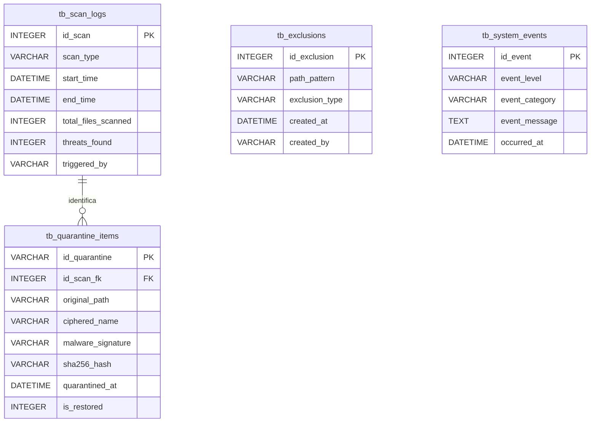

**UNIVERSIDAD PRIVADA DE TACNA**

**FACULTAD DE INGENIERIA**

**Escuela Profesional de Ingeniería de Sistemas**

**Proyecto de Antivirus**

Curso: *Calidad y Pruebas de Software*

Docente: *Mag. Patrick Cuadros Quiroga*

Integrantes:

***LLica Mamani, Jimmy Mijair (2023076789)***

***Sierra Ruiz, Iker Alberto (2023077090)***

**Tacna – Perú**

***2026***

Sistema *RustGuard Antivirus*

Diccionario de Datos

Versión *2.0*

| CONTROL DE VERSIONES | | | | |
|:---:|:---|:---|:---|:---|
| Versión | Hecha por | Revisada por | Aprobada por | Fecha | Motivo |
| 1.0 | Equipo RustGuard | Mag. Patrick Cuadros Quiroga | Equipo RustGuard | 04/07/2026 | Definición Estructural (No-Relacional) |
| 2.0 | Equipo RustGuard | Mag. Patrick Cuadros Quiroga | Equipo RustGuard | 04/07/2026 | Modelado Relacional (SQLite) para Auditoría y Cuarentena |

# Diccionario de Datos: RustGuard - Agente Antivirus y Self-Healing

## 1. Introducción y Especificaciones del Almacenamiento

### 1.1 Propósito
El presente Diccionario de Datos establece la estructura estandarizada de la capa de persistencia del agente **RustGuard**. Su objetivo es proporcionar una visión técnica y relacional sobre cómo el sistema almacena las bitácoras de escaneo, los metadatos de archivos bloqueados y las configuraciones de exclusión, garantizando la trazabilidad y capacidad de recuperación (Self-Healing).

### 1.2 Motor y Versión
El almacenamiento se realiza en **SQLite 3**, incrustado nativamente a través de las dependencias de Node.js en el entorno de Electron. Esta elección permite una base de datos de un solo archivo (ACID compliant) local, sin requerir despliegues complejos de motores de base de datos como MySQL o PostgreSQL en el sistema cliente.

### 1.3 Reglas de Nomenclatura y Tipado
* **Convención de Tablas y Columnas:** Se emplea el formato `snake_case`. Todas las tablas inician con el prefijo `tb_`.
* **Codificación:** Todos los campos de texto (`VARCHAR`, `TEXT`) operan bajo codificación `UTF-8`.
* **Fechas:** Se almacenan nativamente como `DATETIME` (Standard ISO 8601).
* **Tipos Booleanos:** SQLite no tiene clase de almacenamiento `BOOLEAN` estricta, por lo que se emplean `INTEGER` evaluados lógicamente (0 = Falso, 1 = Verdadero).

---

## 2. Modelo Entidad-Relación (ERD)

### 2.1 Diagrama ER

### 2.2 Descripción de Relaciones (Matriz de Relaciones)
* **`tb_scan_logs` (1) a `tb_quarantine_items` (M):** Un registro histórico de un análisis general (`id_scan`) puede haber detectado e identificado cero, una o múltiples amenazas que resulten en cuarentenas individuales. Cada ítem de cuarentena debe apuntar a la tarea de escaneo que descubrió la infección mediante `id_scan_fk`.
* Las tablas `tb_exclusions` y `tb_system_events` funcionan como entidades de catálogo y auditoría estancas, careciendo de relaciones de llave foránea explícitas hacia las otras entidades para prevenir acoplamiento en la purga rotativa de logs.

---

## 3. Especificación Detallada de Tablas (Diccionario)

### 3.1 Tabla: `tb_scan_logs`
* **Propósito:** Almacenar el historial y rendimiento de las tareas de análisis antivirus ejecutadas en el sistema (tanto manuales como en tiempo real).

| Nombre del Campo | Tipo de Dato y Longitud | Restricción (PK/FK) | Nulo (NULL) | Valor por Defecto / Unique | Descripción / Propósito |
| :--- | :--- | :--- | :--- | :--- | :--- |
| `id_scan` | INTEGER | PK | NO | AUTOINCREMENT | Identificador único de la tarea de escaneo. |
| `scan_type` | VARCHAR(50) | Ninguna | NO | Ninguno | Tipo de escaneo ejecutado (Ej. 'FULL_SCAN', 'REALTIME', 'ON_DEMAND'). |
| `start_time` | DATETIME | Ninguna | NO | CURRENT_TIMESTAMP | Fecha y hora de inicio de la tarea. |
| `end_time` | DATETIME | Ninguna | SI | Ninguno | Fecha y hora de finalización (Nulo si fue interrumpido o está en progreso). |
| `total_files_scanned` | INTEGER | Ninguna | NO | 0 | Cantidad total de archivos procesados exitosamente por ClamAV. |
| `threats_found` | INTEGER | Ninguna | NO | 0 | Número total de infecciones detectadas en este lote. |
| `triggered_by` | VARCHAR(100) | Ninguna | NO | 'SYSTEM' | Actor que inició el escaneo (Ej. 'ADMIN_USER', 'FS_WATCHER'). |

### 3.2 Tabla: `tb_quarantine_items`
* **Propósito:** Contener los metadatos forenses requeridos para aislar y potencialmente restaurar un archivo que ha sido cifrado en la bóveda segura del agente.

| Nombre del Campo | Tipo de Dato y Longitud | Restricción (PK/FK) | Nulo (NULL) | Valor por Defecto / Unique | Descripción / Propósito |
| :--- | :--- | :--- | :--- | :--- | :--- |
| `id_quarantine` | VARCHAR(36) | PK | NO | UNIQUE | UUID v4 único generado criptográficamente al momento del aislamiento. |
| `id_scan_fk` | INTEGER | FK | SI | Ninguno | Referencia a `tb_scan_logs` que produjo esta cuarentena. |
| `original_path` | VARCHAR(1024) | Ninguna | NO | Ninguno | Ruta absoluta original donde residía el archivo infectado antes del cifrado. |
| `ciphered_name` | VARCHAR(255) | Ninguna | NO | Ninguno | Nombre del archivo ofuscado almacenado físicamente en la bóveda (Ej. `uuid.enc`). |
| `malware_signature` | VARCHAR(255) | Ninguna | NO | Ninguno | Firma viral o heurística detectada por ClamAV (Ej. 'Win.Trojan.Ransom'). |
| `sha256_hash` | VARCHAR(64) | Ninguna | NO | Ninguno | Hash original del payload malicioso, vital para la auditoría técnica. |
| `quarantined_at` | DATETIME | Ninguna | NO | CURRENT_TIMESTAMP | Fecha y hora exactas del momento de cifrado. |
| `is_restored` | INTEGER (Boolean) | Ninguna | NO | 0 | Flag (0/1) que indica si el administrador forzó el *Self-Healing* o restauración del archivo. |

### 3.3 Tabla: `tb_exclusions`
* **Propósito:** Gestionar la lista blanca de rutas o extensiones que el sistema omitirá durante los monitoreos en tiempo real y escaneos profundos (White-listing).

| Nombre del Campo | Tipo de Dato y Longitud | Restricción (PK/FK) | Nulo (NULL) | Valor por Defecto / Unique | Descripción / Propósito |
| :--- | :--- | :--- | :--- | :--- | :--- |
| `id_exclusion` | INTEGER | PK | NO | AUTOINCREMENT | Identificador numérico de la regla. |
| `path_pattern` | VARCHAR(1024) | Ninguna | NO | UNIQUE | Ruta absoluta, carpeta o expresión regular excluida (Ej. `C:\dev\node_modules\*`). |
| `exclusion_type` | VARCHAR(50) | Ninguna | NO | Ninguno | Naturaleza de la exclusión (Ej. 'DIRECTORY', 'FILE', 'EXTENSION'). |
| `created_at` | DATETIME | Ninguna | NO | CURRENT_TIMESTAMP | Fecha de creación de la exclusión. |
| `created_by` | VARCHAR(100) | Ninguna | NO | 'ADMIN' | Entidad o usuario que aprobó la regla. |

### 3.4 Tabla: `tb_system_events`
* **Propósito:** Registro estandarizado de eventos sistémicos, estado del puente IPC, inicialización de demonios locales y fallos crudos del motor OS.

| Nombre del Campo | Tipo de Dato y Longitud | Restricción (PK/FK) | Nulo (NULL) | Valor por Defecto / Unique | Descripción / Propósito |
| :--- | :--- | :--- | :--- | :--- | :--- |
| `id_event` | INTEGER | PK | NO | AUTOINCREMENT | Identificador de auditoría. |
| `event_level` | VARCHAR(20) | Ninguna | NO | Ninguno | Nivel de severidad técnica (Ej. 'INFO', 'WARN', 'ERROR', 'FATAL'). |
| `event_category` | VARCHAR(50) | Ninguna | NO | Ninguno | Componente emisor del evento (Ej. 'IPC_BRIDGE', 'CLAMAV_DAEMON', 'VAULT_IO'). |
| `event_message` | TEXT | Ninguna | NO | Ninguno | Traza de error detallada, StackTrace o mensaje descriptivo de la transacción. |
| `occurred_at` | DATETIME | Ninguna | NO | CURRENT_TIMESTAMP | Marca temporal de la concurrencia. |

---

## 4. Índices, Triggers y Restricciones de Integridad

### 4.1 Índices de Rendimiento
Para prevenir el estrangulamiento de los hilos IPC de Electron durante consultas voluminosas a la base de datos (Ej. generar tableros de analíticas de 30 días de antigüedad), se instancian los siguientes índices B-Tree:

| Nombre del Índice | Tabla Afectada | Columna(s) | Propósito Funcional |
| :--- | :--- | :--- | :--- |
| `idx_scan_dates` | `tb_scan_logs` | `start_time` DESC | Acelerar significativamente la carga de historiales filtrados por fecha. |
| `idx_quarantine_hash` | `tb_quarantine_items` | `sha256_hash` | Agilizar la validación de archivos repetitivos contra amenazas ya ofuscadas. |
| `idx_sys_events_level` | `tb_system_events` | `event_level`, `occurred_at` | Habilitar búsquedas rápidas en la matriz del componente de Alertas Rojas UI. |

### 4.2 Reglas de Eliminación/Actualización (Constraints)
* **Integridad Referencial de Cuarentenas:** 
  * La llave foránea `id_scan_fk` en `tb_quarantine_items` posee la regla `ON DELETE SET NULL`. De este modo, si un administrador decide purgar el historial de escaneos para limpiar base de datos, los registros críticos de cuarentena (donde aún reside el archivo físico cifrado) no serán borrados accidentalmente (*Cascading Protection*).
* **Bloqueo Transaccional (Concurrency):** 
  * Todas las actualizaciones en la tabla de `tb_quarantine_items` operan bajo sentencias de *Prepared Statements*, mitigando cualquier posibilidad de inyecciones SQL que pudieran fraguar un reseteo ilícito de un malware detectado.
