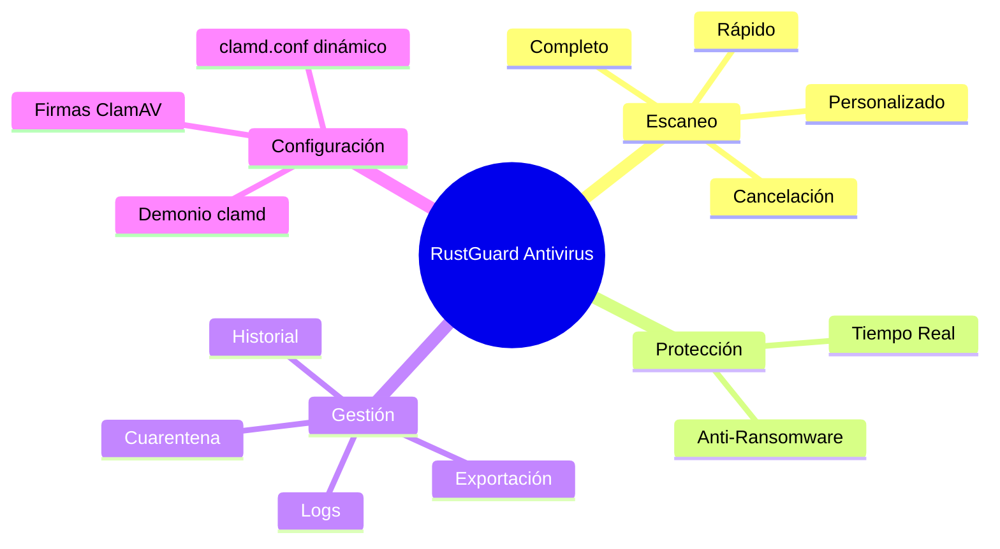
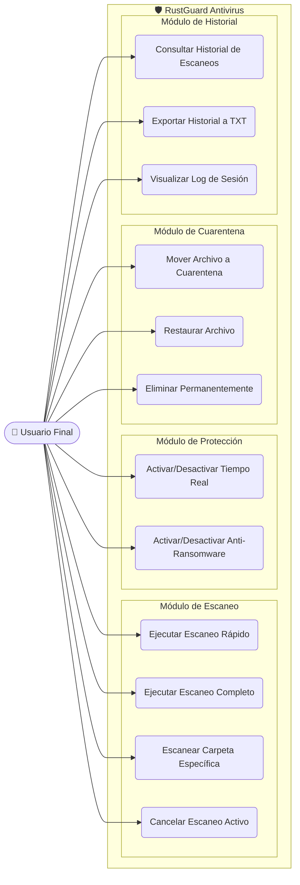
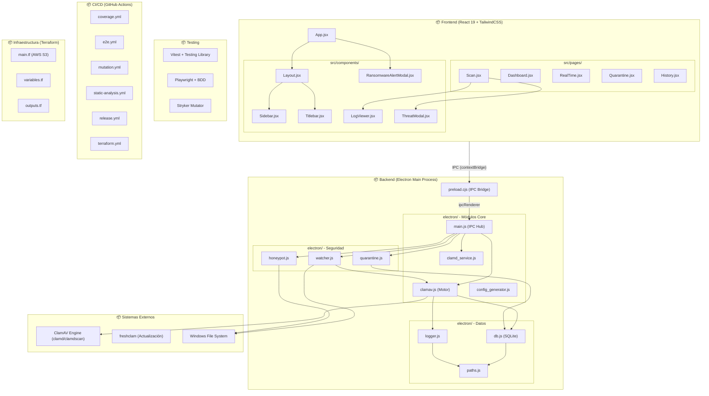

**UNIVERSIDAD PRIVADA DE TACNA**

**FACULTAD DE INGENIERIA**

**Escuela Profesional de Ingeniería de Sistemas**

**Proyecto de Antivirus**

Curso: *Calidad y Pruebas de Software*

Docente: *Mag. Patrick Cuadros Quiroga*

Integrantes:

***LLica Mamani, Jimmy Mijair (2023076789)***

***Sierra Ruiz, Iker Alberto (2023077090)***

**Tacna – Perú**

***2026***

Sistema *RustGuard Antivirus*

Informe de Especificación de Requerimientos

Versión *2.0*

| CONTROL DE VERSIONES | | | | |
|:---:|:---|:---|:---|:---|
| Versión | Hecha por | Revisada por | Aprobada por | Fecha | Motivo |
| 1.0 | LLica Mamani, Jimmy Mijair | Sierra Ruiz, Iker Alberto | LLica Mamani, Jimmy Mijair | 02/06/2026 | Versión Inicial |
| 2.0 | Equipo RustGuard | Mag. Patrick Cuadros Quiroga | Equipo RustGuard | 04/07/2026 | Especificación completa basada en código fuente |

# **INDICE GENERAL**

[1. Introducción](#1-introducción)

&nbsp;&nbsp;[1.1 Propósito](#11-propósito)

&nbsp;&nbsp;[1.2 Alcance](#12-alcance)

&nbsp;&nbsp;[1.3 Definiciones y Acrónimos](#13-definiciones-y-acrónimos)

[2. Descripción General](#2-descripción-general)

&nbsp;&nbsp;[2.1 Perspectiva del Producto](#21-perspectiva-del-producto)

&nbsp;&nbsp;[2.2 Funciones del Producto](#22-funciones-del-producto)

[3. Requerimientos Funcionales](#3-requerimientos-funcionales)

&nbsp;&nbsp;[3.1 Módulo de Escaneo (Motor ClamAV)](#31-módulo-de-escaneo-motor-clamav)

&nbsp;&nbsp;[3.2 Módulo de Protección en Tiempo Real](#32-módulo-de-protección-en-tiempo-real)

&nbsp;&nbsp;[3.3 Módulo Anti-Ransomware (Honeypot)](#33-módulo-anti-ransomware-honeypot)

&nbsp;&nbsp;[3.4 Módulo de Cuarentena](#34-módulo-de-cuarentena)

&nbsp;&nbsp;[3.5 Módulo de Historial y Logs](#35-módulo-de-historial-y-logs)

&nbsp;&nbsp;[3.6 Módulo de Interfaz de Usuario](#36-módulo-de-interfaz-de-usuario)

[4. Requerimientos No Funcionales](#4-requerimientos-no-funcionales)

&nbsp;&nbsp;[4.1 Rendimiento](#41-rendimiento)

&nbsp;&nbsp;[4.2 Seguridad](#42-seguridad)

&nbsp;&nbsp;[4.3 Usabilidad](#43-usabilidad)

&nbsp;&nbsp;[4.4 Portabilidad](#44-portabilidad)

[5. Diagrama de Casos de Uso General](#5-diagrama-de-casos-de-uso-general)

[6. Diagrama de Paquetes](#6-diagrama-de-paquetes)

[7. Especificación de Casos de Uso](#7-especificación-de-casos-de-uso)

## 1. Introducción

### 1.1 Propósito

El presente documento tiene como propósito definir de manera exhaustiva todos los requerimientos funcionales y no funcionales del sistema **RustGuard Antivirus**, una aplicación de escritorio basada en Electron y React que integra el motor antivirus ClamAV. Este informe constituye un contrato técnico entre el equipo de desarrollo y los interesados del proyecto, sirviendo como referencia para las fases de diseño, implementación, pruebas y validación.

### 1.2 Alcance

El sistema RustGuard Antivirus abarca los siguientes módulos funcionales:
- **Motor de escaneo** con tres modalidades (rápido, completo, personalizado)
- **Protección en tiempo real** del sistema de archivos
- **Escudo anti-ransomware** basado en heurística por honeypots
- **Gestión de cuarentena** con persistencia en SQLite
- **Historial y logging** con exportación
- **Interfaz gráfica** con ventana Frameless y tema oscuro

### 1.3 Definiciones y Acrónimos

| Término | Definición |
| :--- | :--- |
| **ClamAV** | Motor antivirus de código abierto desarrollado por Cisco, basado en detección por firmas. |
| **clamd** | Demonio (servicio en background) de ClamAV que mantiene las firmas cargadas en memoria. |
| **clamdscan** | Cliente de línea de comandos que envía archivos al demonio clamd para su análisis. |
| **freshclam** | Herramienta de actualización automática de firmas ClamAV desde servidores remotos. |
| **IPC** | Inter-Process Communication. Mecanismo de Electron para comunicar el proceso Main con el Renderer. |
| **Honeypot** | Archivo señuelo desplegado intencionalmente para detectar actividad maliciosa. |
| **WAL** | Write-Ahead Logging. Modo de SQLite que mejora la integridad y el rendimiento de escritura. |
| **BDD** | Behavior-Driven Development. Metodología que define pruebas en lenguaje natural (Gherkin). |

---

## 2. Descripción General

### 2.1 Perspectiva del Producto

RustGuard es un producto de software independiente que se ejecuta como aplicación de escritorio nativa mediante Electron.js. No depende de servicios en la nube para su funcionamiento core (escaneo, cuarentena, historial). La única comunicación externa ocurre durante la actualización de firmas (`freshclam`), que contacta con `database.clamav.net`.

### 2.2 Funciones del Producto

El producto provee las siguientes funciones de alto nivel:

---

## 3. Requerimientos Funcionales

### 3.1 Módulo de Escaneo (Motor ClamAV)

| ID | Requerimiento | Prioridad | Implementación |
| :---: | :--- | :---: | :--- |
| **RF-01** | El sistema debe ejecutar un escaneo rápido que analice las carpetas `AppData`, `Downloads`, `Temp` y `Startup` del usuario activo. | Alta | `clamav.js → quickScan()` |
| **RF-02** | El sistema debe ejecutar un escaneo completo del disco `C:\` de la máquina. | Alta | `clamav.js → fullScan()` |
| **RF-03** | El sistema debe permitir al usuario seleccionar una carpeta específica mediante un diálogo nativo del SO para escaneo personalizado. | Alta | `main.js → select-folder` + `clamav.js → scanTarget()` |
| **RF-04** | El sistema debe recopilar recursivamente todos los archivos del directorio objetivo en un archivo temporal de lista antes de invocar clamdscan. | Media | `clamav.js → generateScanList()` |
| **RF-05** | El sistema debe parsear cada línea de salida de clamdscan clasificándola como `CLEAN`, `THREAT`, `IGNORED` o `INFO`. | Alta | `clamav.js → parseClamScanLine()` |
| **RF-06** | El sistema debe permitir cancelar un escaneo activo en cualquier momento, tanto durante la recopilación de archivos como durante el análisis ClamAV. | Alta | `clamav.js → cancelActiveScan()` |
| **RF-07** | El sistema debe actualizar automáticamente las firmas ClamAV al arrancar la aplicación usando `freshclam`. | Media | `clamav.js → updateSignatures()` |
| **RF-08** | El sistema debe iniciar el demonio `clamd` con configuración dinámica al arranque, esperando hasta 15 segundos como fallback de inicialización. | Alta | `clamd_service.js → startClamdService()` |
| **RF-09** | El sistema debe generar dinámicamente los archivos `clamd.conf` y `freshclam.conf` en el directorio userData con rutas absolutas correctas. | Media | `config_generator.js → generateClamAVConfigs()` |

### 3.2 Módulo de Protección en Tiempo Real

| ID | Requerimiento | Prioridad | Implementación |
| :---: | :--- | :---: | :--- |
| **RF-10** | El sistema debe monitorear en tiempo real las carpetas `Downloads` y `Desktop` del usuario usando el módulo `chokidar`. | Alta | `watcher.js → startWatcher()` |
| **RF-11** | El sistema debe configurar `awaitWriteFinish` con una estabilización de 2000ms para evitar escanear archivos parcialmente descargados. | Media | `watcher.js` (options) |
| **RF-12** | El sistema debe encolar los archivos detectados y procesarlos secuencialmente para evitar sobrecargar el motor ClamAV. | Alta | `watcher.js → handleFileChange() + processQueue()` |
| **RF-13** | Si se detecta una amenaza en tiempo real, el sistema debe emitir una notificación nativa de Windows y enviar una señal IPC al frontend. | Alta | `watcher.js → Notification + win.webContents.send('threat-detected')` |
| **RF-14** | El sistema debe permitir activar y desactivar la protección en tiempo real desde el frontend sin reiniciar la aplicación. | Alta | `main.js → toggle-realtime` |

### 3.3 Módulo Anti-Ransomware (Honeypot)

| ID | Requerimiento | Prioridad | Implementación |
| :---: | :--- | :---: | :--- |
| **RF-15** | El sistema debe desplegar archivos señuelo ocultos (`.rg_canary.docx`, `.rg_canary.jpg`) en las carpetas `Documents` y `Desktop`. | Alta | `honeypot.js → deployHoneypots()` |
| **RF-16** | Los archivos honeypot deben marcarse como ocultos en Windows mediante el comando `attrib +h`. | Media | `honeypot.js` (child_process exec) |
| **RF-17** | El sistema debe monitorear los archivos honeypot con `chokidar` para detectar eventos de `change` (modificación) y `unlink` (eliminación). | Alta | `honeypot.js → startAntiRansomware()` |
| **RF-18** | Si un honeypot es alterado, el sistema debe: forzar la ventana a primer plano (`alwaysOnTop`), maximizar la ventana y enviar una alerta crítica al frontend. | Crítica | `honeypot.js → handleRansomwareDetection()` |
| **RF-19** | Al desactivar el anti-ransomware, el sistema debe eliminar todos los archivos honeypot del disco y cerrar el watcher. | Media | `honeypot.js → stopAntiRansomware()` |

### 3.4 Módulo de Cuarentena

| ID | Requerimiento | Prioridad | Implementación |
| :---: | :--- | :---: | :--- |
| **RF-20** | El sistema debe mover archivos infectados a una carpeta de cuarentena en `userData/quarantine/`, renombrándolos con timestamp y extensión `.quar`. | Alta | `quarantine.js → quarantineFile()` |
| **RF-21** | El sistema debe registrar en la tabla `quarantine` de SQLite la ruta original, ruta de cuarentena, nombre de amenaza y fecha de aislamiento. | Alta | `db.js → insertQuarantineRecord()` |
| **RF-22** | El sistema debe permitir restaurar un archivo desde cuarentena a su ruta original, actualizando el registro en la base de datos. | Media | `quarantine.js → restoreFile()` |
| **RF-23** | El sistema debe permitir eliminar permanentemente un archivo de cuarentena del disco, marcándolo como procesado en la base de datos. | Media | `quarantine.js → deletePermanently()` |
| **RF-24** | El sistema debe mostrar en la UI únicamente los registros de cuarentena activos (campo `restored = 0`). | Baja | `Quarantine.jsx → filter(r => r.restored === 0)` |

### 3.5 Módulo de Historial y Logs

| ID | Requerimiento | Prioridad | Implementación |
| :---: | :--- | :---: | :--- |
| **RF-25** | El sistema debe registrar el inicio de cada escaneo en la tabla `scan_history` con tipo, fecha de inicio, ruta del log y estado `running`. | Alta | `db.js → insertScanStart()` |
| **RF-26** | El sistema debe actualizar el registro al finalizar con la fecha de fin, archivos escaneados, amenazas encontradas y estado final (`completed`, `cancelled`, `error`). | Alta | `db.js → updateScanFinish()` |
| **RF-27** | Cada sesión de escaneo debe generar un archivo de log con formato `YYYY-MM-DD_HH-MM-SS.log` en el directorio `userData/logs/`. | Media | `logger.js → initSessionLog()` |
| **RF-28** | El sistema debe emitir cada línea de log al proceso Renderer vía IPC para el visor en tiempo real. | Alta | `logger.js → writeLog()` |
| **RF-29** | El sistema debe permitir exportar el historial completo a un archivo `.txt` con formato legible, usando un diálogo nativo de guardado. | Media | `main.js → export-history` |
| **RF-30** | El sistema debe permitir abrir y visualizar el log de cualquier escaneo pasado en un modal con scroll y parsing de niveles. | Baja | `History.jsx → handleOpenLog()` |

### 3.6 Módulo de Interfaz de Usuario

| ID | Requerimiento | Prioridad | Implementación |
| :---: | :--- | :---: | :--- |
| **RF-31** | La aplicación debe presentar una ventana Frameless con barra de título personalizada que incluya botones de minimizar, maximizar y cerrar. | Alta | `Titlebar.jsx` + `main.js (frame: false)` |
| **RF-32** | La barra lateral debe mostrar 5 secciones de navegación: Dashboard, Escaneo, Tiempo Real, Cuarentena e Historial. | Alta | `Sidebar.jsx` |
| **RF-33** | El Dashboard debe mostrar el estado general del sistema (PROTEGIDO/AMENAZA/ESCANEANDO), estadísticas de firmas, último escaneo y toggle de tiempo real. | Alta | `Dashboard.jsx` |
| **RF-34** | Al detectar una amenaza en cualquier modo de escaneo, el sistema debe mostrar un modal con el nombre de la amenaza, la ruta del archivo y opciones de cuarentena o ignorar. | Alta | `ThreatModal.jsx` |
| **RF-35** | Al detectar actividad de ransomware, el sistema debe mostrar un modal de pantalla completa con fondo rojo y recomendaciones de emergencia. | Crítica | `RansomwareAlertModal.jsx` |
| **RF-36** | El visor de logs debe soportar auto-scroll, colorización por nivel (SUCCESS, DANGER, WARNING, INFO) y copiado al portapapeles. | Media | `LogViewer.jsx` |
| **RF-37** | La aplicación debe mostrar un splash screen durante la carga inicial de firmas y el arranque del demonio ClamAV. | Baja | `splash.html` + `main.js` |

---

## 4. Requerimientos No Funcionales

### 4.1 Rendimiento

| ID | Requerimiento | Métrica |
| :---: | :--- | :--- |
| **RNF-01** | El escaneo rápido no debe bloquear la interfaz de usuario en ningún momento. | 0 congelamientos de UI (spawn asíncrono) |
| **RNF-02** | La actualización de firmas debe completarse en menos de 60 segundos con conexión estable. | ≤ 60s |
| **RNF-03** | El demonio clamd debe estar operativo en máximo 15 segundos tras el arranque. | ≤ 15s (fallback timeout) |
| **RNF-04** | El monitoreo en tiempo real debe esperar 2 segundos de estabilización antes de escanear un archivo nuevo. | `stabilityThreshold: 2000ms` |

### 4.2 Seguridad

| ID | Requerimiento | Implementación |
| :---: | :--- | :--- |
| **RNF-05** | El proceso Renderer no debe tener acceso directo a las APIs de Node.js (`nodeIntegration: false`). | `main.js → webPreferences` |
| **RNF-06** | Toda comunicación entre Main y Renderer debe pasar por el `contextBridge` con APIs explícitamente expuestas. | `preload.cjs → contextBridge.exposeInMainWorld()` |
| **RNF-07** | La base de datos SQLite debe operar en modo WAL para garantizar integridad ante cierres inesperados. | `db.js → db.pragma('journal_mode = WAL')` |
| **RNF-08** | Los archivos temporales de listas de escaneo deben ser eliminados al finalizar o cancelar el escaneo. | `clamav.js → fs.unlinkSync(listFilePath)` |

### 4.3 Usabilidad

| ID | Requerimiento |
| :---: | :--- |
| **RNF-09** | La interfaz debe seguir un tema oscuro con paleta de colores definida en variables CSS. |
| **RNF-10** | Todos los elementos interactivos deben tener feedback visual (hover, transiciones, animaciones). |
| **RNF-11** | Los estados vacíos deben mostrar mensajes claros e iconografía descriptiva (ej. "La cuarentena está vacía"). |
| **RNF-12** | Las acciones destructivas (restaurar archivo infectado, eliminar permanentemente) deben requerir confirmación del usuario. |

### 4.4 Portabilidad

| ID | Requerimiento |
| :---: | :--- |
| **RNF-13** | La aplicación debe generar una versión portable (sin instalación) además del instalador NSIS. |
| **RNF-14** | Las firmas ClamAV deben distribuirse como `extraResources` del empaquetado de Electron para ejecución sin conexión. |
| **RNF-15** | El sistema debe crear automáticamente los directorios necesarios (`logs/`, `db/`, `quarantine/`, `clamav_db/`) en el primer arranque. |

---

## 5. Diagrama de Casos de Uso General

---

## 6. Diagrama de Paquetes

---

## 7. Especificación de Casos de Uso

### CU-01: Ejecutar Escaneo Rápido

| Elemento | Descripción |
| :--- | :--- |
| **Actor** | Usuario Final |
| **Precondiciones** | ClamAV instalado. Demonio clamd activo. No hay escaneo en curso. |
| **Flujo Principal** | 1. El usuario navega a la sección "Escaneo". 2. Hace clic en "Escaneo Rápido". 3. El sistema recopila archivos de AppData, Downloads, Temp y Startup. 4. Se invoca `clamdscan` con la lista de archivos. 5. Los resultados se muestran en el visor de logs. 6. Al finalizar, se registra en el historial. |
| **Flujo Alternativo** | Si ClamAV no está instalado, se registra un error en el log y se retorna un resultado vacío. |
| **Postcondiciones** | Historial actualizado. Log de sesión generado. |

### CU-05: Activar/Desactivar Protección en Tiempo Real

| Elemento | Descripción |
| :--- | :--- |
| **Actor** | Usuario Final |
| **Precondiciones** | Aplicación en ejecución. |
| **Flujo Principal** | 1. El usuario hace clic en el toggle de Tiempo Real (Dashboard o sección Protección). 2. Si se activa: se inicia `chokidar` en Downloads y Desktop. 3. Si se desactiva: se cierra el watcher. 4. El estado se actualiza en la UI en tiempo real. |
| **Postcondiciones** | Monitoreo activo o inactivo según la acción del usuario. |

### CU-06: Activar Escudo Anti-Ransomware

| Elemento | Descripción |
| :--- | :--- |
| **Actor** | Usuario Final |
| **Precondiciones** | Aplicación en ejecución. Carpetas Documents y Desktop accesibles. |
| **Flujo Principal** | 1. El usuario activa el toggle Anti-Ransomware. 2. Se despliegan archivos honeypot ocultos. 3. Se inicia monitoreo de los honeypots. 4. Si un honeypot es alterado: se fuerza la ventana a primer plano y se muestra alerta crítica. |
| **Flujo Alternativo** | Si no se pueden crear honeypots (permisos), se registra warning y el módulo queda inactivo. |
| **Postcondiciones** | Honeypots desplegados y monitoreados, o eliminados si se desactiva. |

### CU-07: Mover Archivo a Cuarentena

| Elemento | Descripción |
| :--- | :--- |
| **Actor** | Usuario Final |
| **Precondiciones** | Se ha detectado una amenaza (modal ThreatModal visible). |
| **Flujo Principal** | 1. El usuario hace clic en "Mover a Cuarentena" en el modal. 2. El archivo se renombra con timestamp y extensión `.quar`. 3. Se mueve a `userData/quarantine/`. 4. Se registra en la tabla `quarantine` de SQLite. 5. El modal se cierra. |
| **Postcondiciones** | Archivo aislado. Registro en base de datos creado. |

---

## Bibliografía

1. IEEE Computer Society. (1998). *IEEE Recommended Practice for Software Requirements Specifications (IEEE Std 830-1998)*. IEEE.
2. Cockburn, A. (2001). *Writing Effective Use Cases*. Addison-Wesley Professional.
3. Electron. (2025). *Context Isolation*. Recuperado de https://www.electronjs.org/docs/latest/tutorial/context-isolation
4. ClamAV. (2025). *ClamAV Configuration Reference*. Recuperado de https://docs.clamav.net/manual/Usage/Configuration.html
5. Chokidar. (2025). *Chokidar API Documentation*. Recuperado de https://github.com/paulmillr/chokidar
