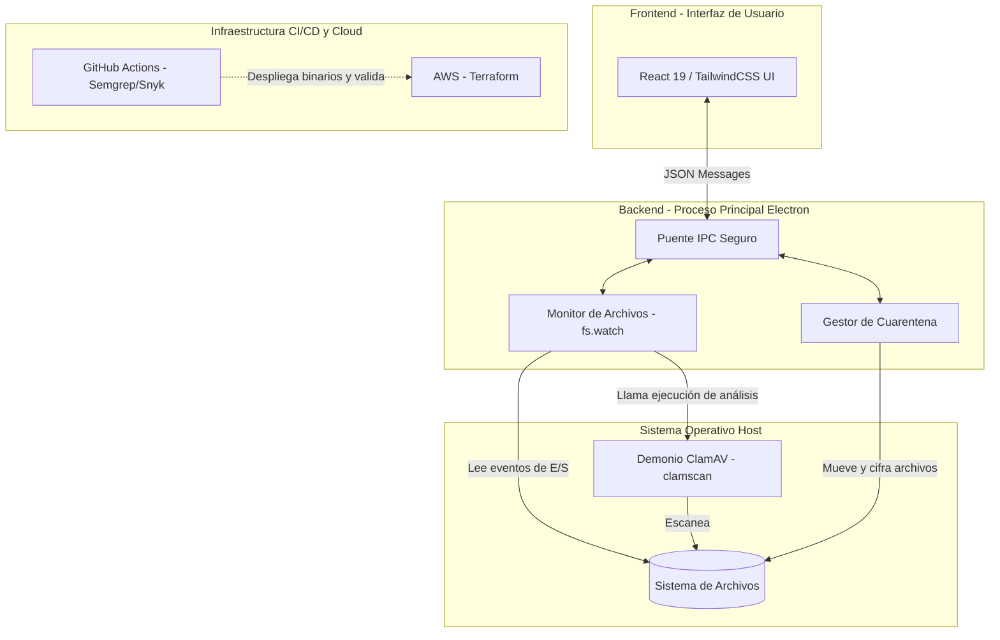
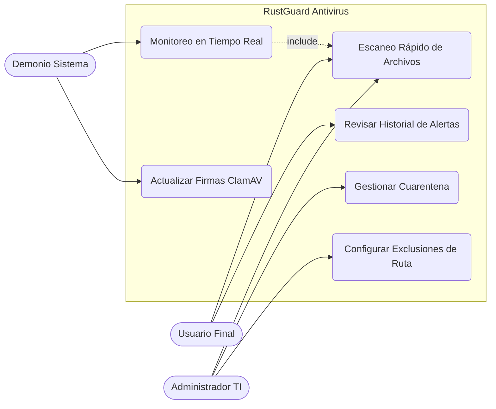
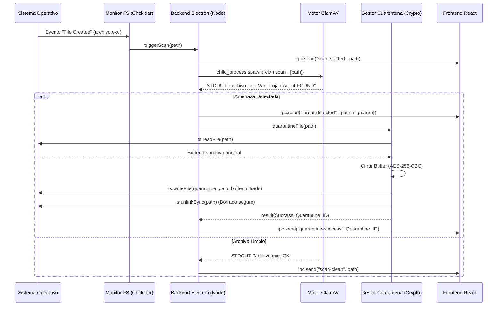

**UNIVERSIDAD PRIVADA DE TACNA**

**FACULTAD DE INGENIERIA**

**Escuela Profesional de Ingeniería de Sistemas**

**Proyecto de Antivirus**

Curso: *Calidad y Pruebas de Software*

Docente: *Mag. Patrick Cuadros Quiroga*

Integrantes:

***LLica Mamani, Jimmy Mijair (2023076789)***

***Sierra Ruiz, Iker Alberto (2023077090)***

**Tacna – Perú**

***2026***

Sistema *RustGuard Antivirus*

Informe de Especificación de Requerimientos

Versión *2.0*

| CONTROL DE VERSIONES | | | | |
|:---:|:---|:---|:---|:---|
| Versión | Hecha por | Revisada por | Aprobada por | Fecha | Motivo |
| 1.0 | LLica Mamani, Jimmy Mijair | Sierra Ruiz, Iker Alberto | LLica Mamani, Jimmy Mijair | 02/06/2026 | Versión Inicial |
| 2.0 | Equipo RustGuard | Mag. Patrick Cuadros Quiroga | Equipo RustGuard | 04/07/2026 | Especificación consolidada (Tres subsistemas) |

# **ÍNDICE GENERAL**

1. [Introducción](#1-introducción)
2. [Descripción General](#2-descripción-general)
3. [Modelado del Sistema y Casos de Uso](#3-modelado-del-sistema-y-casos-de-uso)
4. [Requisitos Funcionales Específicos (RF)](#4-requisitos-funcionales-específicos-rf)
5. [Requisitos No Funcionales (RNF)](#5-requisitos-no-funcionales-rnf)
6. [Interfaces Externas](#6-interfaces-externas)
7. [Diagrama de Comportamiento Dinámico](#7-diagrama-de-comportamiento-dinámico)

# 1. Introducción

### 1.1 Propósito
El presente documento de Especificación de Requisitos de Software (SRS / FD03) tiene como propósito definir detalladamente los requerimientos funcionales y no funcionales del proyecto **RustGuard - Antivirus System**. Este documento está dirigido a los desarrolladores de software, ingenieros de QA, arquitectos de sistemas y *stakeholders* del proyecto, estableciendo una base rigurosa (acorde a estándares tipo IEEE 830) para el desarrollo, validación y despliegue del producto.

### 1.2 Alcance del Producto
RustGuard es una aplicación de seguridad *endpoint* de escritorio que provee protección contra malware en tiempo real, análisis bajo demanda y un entorno de cuarentena seguro. Desarrollada con un modelo de separación de privilegios usando **React 19** para el frontend y **Electron** para el backend (con integración a **ClamAV**), la solución centraliza la gestión local de amenazas sin incurrir en consumos excesivos de memoria. El sistema se apoya adicionalmente en una infraestructura *cloud* orquestada por Terraform para futuras integraciones, basando su ciclo de vida en flujos estrictos de integración continua (GitHub Actions).

### 1.3 Convenciones del Documento
* **RF-XX:** Requisito Funcional número XX.
* **RNF-XX:** Requisito No Funcional número XX.
* **CU-XX:** Caso de Uso número XX.
* **Prioridades:** 
  * **Alta:** Imprescindible para el lanzamiento (MVP).
  * **Media:** Necesaria pero con *workarounds* temporales.
  * **Baja:** Deseable para iteraciones futuras.
* **IPC (Inter-Process Communication):** Mecanismo de paso de mensajes entre el proceso de renderizado (React) y el proceso principal (Node.js/Electron).

---

# 2. Descripción General

### 2.1 Perspectiva del Producto
RustGuard opera como un sistema autónomo en el equipo local del usuario, interceptando llamadas al sistema de archivos y delegando el análisis criptográfico y heurístico al demonio de ClamAV instalado en el host.

### 2.2 Funciones del Producto
1. Monitoreo en tiempo real de los directorios críticos (ej. Descargas).
2. Escaneo de archivos, carpetas y discos bajo demanda.
3. Gestión del aislamiento de archivos en bóveda de cuarentena cifrada.
4. Consulta y visualización de reportes históricos de escaneo.
5. Actualización automatizada de la base de datos de firmas locales.

### 2.3 Características de los Usuarios
* **Usuario Final:** Posee conocimientos informáticos básicos. Requiere una interfaz altamente reactiva y visual (cero configuraciones manuales complejas) que simplemente informe sobre el estado de seguridad.
* **Administrador del Sistema / TI:** Usuario técnico con privilegios elevados. Configura reglas de exclusión, revisa logs de comportamiento detallados y administra la cuarentena global del equipo.

### 2.4 Restricciones de Diseño e Implementación
* El frontend no tiene acceso nativo a APIs de Node.js por diseño (seguridad de Electron). Toda comunicación debe hacerse vía `contextBridge`.
* Dependencia estricta del binario ejecutable `clamscan` de ClamAV en el sistema operativo local.
* La aplicación se distribuye como un paquete cerrado (.exe, .deb o .dmg) gestionado a través de los pipelines de liberación.

---

# 3. Modelado del Sistema y Casos de Uso

### 3.1 Diagrama de Casos de Uso

### 3.2 Especificación de Casos de Uso Principales

| ID | Nombre | Actor | Precondiciones | Flujo Principal | Flujos Alternativos | Postcondiciones |
|:---|:---|:---|:---|:---|:---|:---|
| **CU-01** | Escaneo Bajo Demanda | Usuario Final | El servicio principal de Electron y ClamAV están en ejecución. | 1. El usuario selecciona un archivo/carpeta en la GUI.   2. La UI envía mensaje IPC de inicio de escaneo.   3. El backend invoca a `clamscan`.   4. El motor analiza el archivo y retorna `STDOUT`.   5. La UI muestra el resultado (Limpio o Infectado). | **3a.** ClamAV no está instalado/accesible: El sistema notifica error de dependencia y aborta. | El resultado se almacena en los logs locales de SQLite. |
| **CU-02** | Gestión de Cuarentena (Aislamiento) | Administrador TI | Una amenaza ha sido detectada en un escaneo previo. | 1. El admin ingresa a la pestaña "Cuarentena".   2. Selecciona un archivo infectado y elige "Aislar".   3. El backend lee el archivo y lo cifra (ej. AES-256).   4. Se mueve el archivo cifrado a la bóveda.   5. Se elimina el original del directorio fuente. | **5a.** Permisos insuficientes para borrar: El backend intenta escalar privilegios y de fallar, notifica al usuario crítico. | El archivo ya no representa riesgo de ejecución; estado guardado en base de datos. |
| **CU-03** | Actualización de Firmas | Demonio Sistema | Conexión a Internet activa en el host. | 1. El temporizador interno dispara el evento (cada 12h).   2. El proceso principal ejecuta `freshclam`.   3. Se descargan las firmas `.cvd` nuevas.   4. Se reinicia silenciosamente el worker del demonio. | **3a.** Conexión de red caída: El sistema encola el reintento para dentro de 1 hora. | ClamAV queda operando con las últimas bases de virus disponibles. |

---

# 4. Requisitos Funcionales Específicos (RF)

| ID | Módulo | Descripción Técnica Detallada | Prioridad |
|:---|:---|:---|:---|
| **RF-01** | Core / Escáner | El sistema debe proveer una vía IPC (`ipcMain.handle('scan-path', callback)`) que reciba rutas absolutas y ejecute un subproceso asíncrono llamando a `clamscan <path>`. | Alta |
| **RF-02** | Core / Escáner | El resultado del proceso de ClamAV (STDOUT) debe ser analizado mediante expresiones regulares para identificar y extraer el término "FOUND" y el nombre de la firma de virus detectada. | Alta |
| **RF-03** | Interfaz / GUI | El frontend en React debe renderizar un Dashboard principal visualizando 3 métricas en tiempo real: Archivos escaneados hoy, Amenazas detectadas, y Estado de la firma. | Alta |
| **RF-04** | Cuarentena | La función de cuarentena debe utilizar el módulo `crypto` de Node.js para cifrar el *buffer* del archivo detectado usando el algoritmo `aes-256-cbc` antes de escribirlo en la carpeta segura. | Alta |
| **RF-05** | Cuarentena | El sistema debe almacenar metadatos de cuarentena (Ruta original, Hash MD5, Fecha, Vector de Inicialización del cifrado) en un archivo JSON o base de datos SQLite local incrustada. | Media |
| **RF-06** | Cuarentena | El sistema debe proveer una acción de "Restauración", que descifre el archivo utilizando la clave asimétrica interna y lo mueva de regreso a su ruta original. | Media |
| **RF-07** | Monitor | El sistema debe utilizar la API `fs.watch()` (o librerías como `chokidar`) para detectar de forma pasiva eventos de creación de archivos (`add`) en las carpetas "Descargas" y "Documentos". | Alta |
| **RF-08** | Interfaz / Log | Todo escaneo finalizado debe registrar un evento en un archivo de log estandarizado (formato NDJSON o texto plano) almacenado en `%APPDATA%/RustGuard/logs`. | Media |
| **RF-09** | Actualizador | El sistema debe invocar mediante `child_process.exec` el comando `freshclam` para forzar la actualización de definiciones, manejando el retorno de código `0` como éxito. | Alta |
| **RF-10** | Configuración | La interfaz debe permitir al usuario añadir *strings* de exclusión (Regex o rutas parciales). El servicio backend omitirá enviar a `clamscan` cualquier archivo que coincida con dichas exclusiones. | Baja |

---

# 5. Requisitos No Funcionales (RNF)

| Categoría | Atributo de Calidad / Requisito |
|:---|:---|
| **Rendimiento** | **RNF-01:** La huella de memoria (RAM) del proceso de UI (Electron Render) no debe superar los 150 MB en estado de inactividad (Idle). **RNF-02:** El tiempo de inicialización de la interfaz (desde doble clic al icono hasta renderizado del DOM) debe ser menor a 2.5 segundos. |
| **Seguridad** | **RNF-03:** El protocolo `nodeIntegration` debe estar estrictamente en `false` en la ventana principal de Electron, delegando funciones exclusivas a través del `preload.js` (Context Isolation). **RNF-04:** Las llaves AES usadas para la cuarentena deben generarse y almacenarse en los anillos de claves seguros del SO anfitrión (ej. Windows Credential Manager / Keychain). |
| **Confiabilidad y Disponibilidad** | **RNF-05:** Si el subproceso de monitoreo de directorios lanza una excepción fatal, un proceso "Watchdog" interno debe reiniciar el servicio en menos de 5 segundos sin cerrar la ventana gráfica. |
| **Mantenibilidad** | **RNF-06:** El código debe adherirse a los lineamientos arquitectónicos separados (Clean Architecture), donde la lógica de negocio (casos de uso) y la infraestructura (ClamAV, Sistema de Archivos) están desacopladas mediante interfaces abstractas en TypeScript. **RNF-07:** Todos los componentes de React deben contar con pruebas funcionales usando Testing Library y Vitest garantizando un >60% de cobertura. |

---

# 6. Interfaces Externas

### 6.1 Interfaces de Usuario (GUI)
La interfaz se desarrolla en **React 19** con **TailwindCSS 4**. Debe ofrecer:
* **Tema Oscuro (Dark Mode) Nativo:** Alineado con estándares de aplicaciones modernas.
* **Componentes Reactivos:** Uso de framer-motion o transiciones CSS para mostrar barras de progreso fluidas durante escaneos largos.
* **Notificaciones de Sistema (Toasts/OS Notifications):** Uso de la API nativa `Notification` de HTML5 (orquestada por Electron) para advertir al usuario sobre amenazas cuando la ventana principal esté minimizada.

### 6.2 Interfaces de Software/APIs
* **Interfaz ClamAV (CLI):** La comunicación con el motor subyacente se realiza íntegramente a través de la CLI del sistema local utilizando *Standard In/Out*.
* **Interfaz de Sistema de Archivos:** Integración profunda con APIs de Node.js (`fs`, `path`, `os`) para la lectura agresiva de descriptores de archivos de manera asíncrona (Stream/Buffer).
* **Endpoints de Telemetría (Futuro):** La aplicación debe estructurarse para permitir *webhooks* salientes (JSON sobre HTTPS) hacia la infraestructura aprovisionada por Terraform en AWS para reporte centralizado de incidentes en entornos corporativos.

---

# 7. Diagrama de Comportamiento Dinámico

El siguiente diagrama de secuencia detalla el proceso crítico de escaneo en tiempo real de un archivo nuevo y su consecuente gestión de cuarentena, evidenciando las interacciones entre los componentes del sistema.

