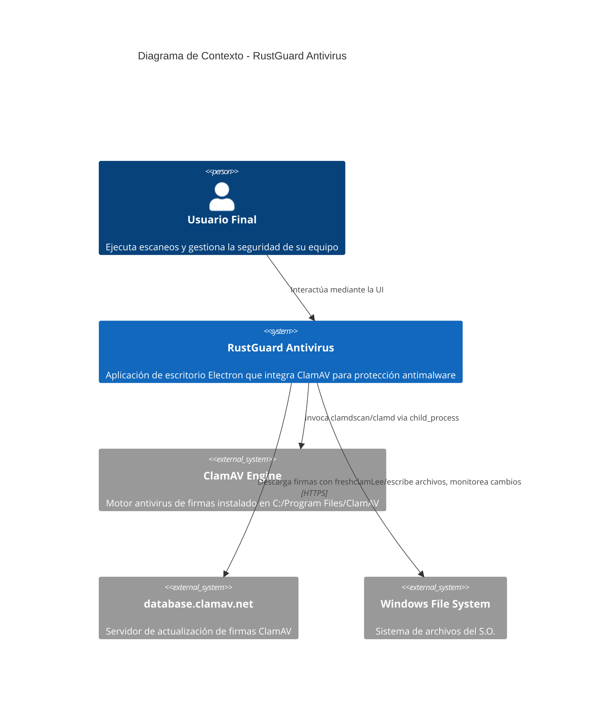
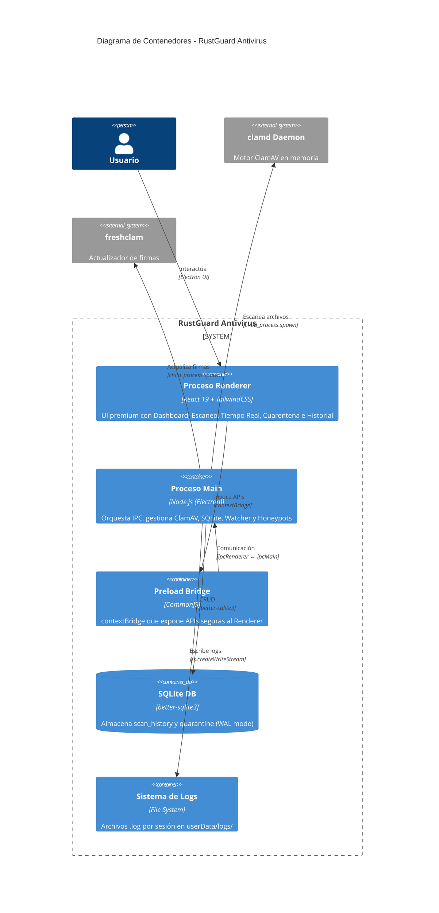
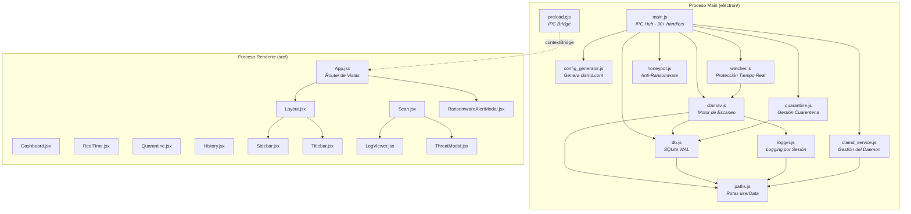
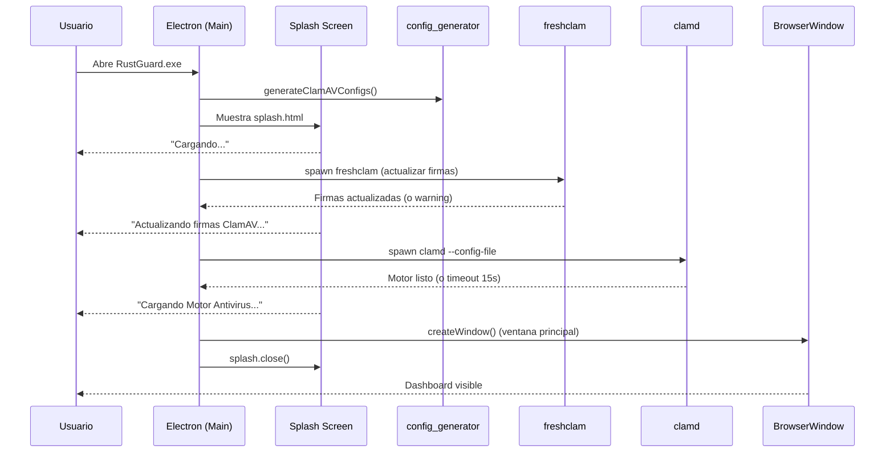
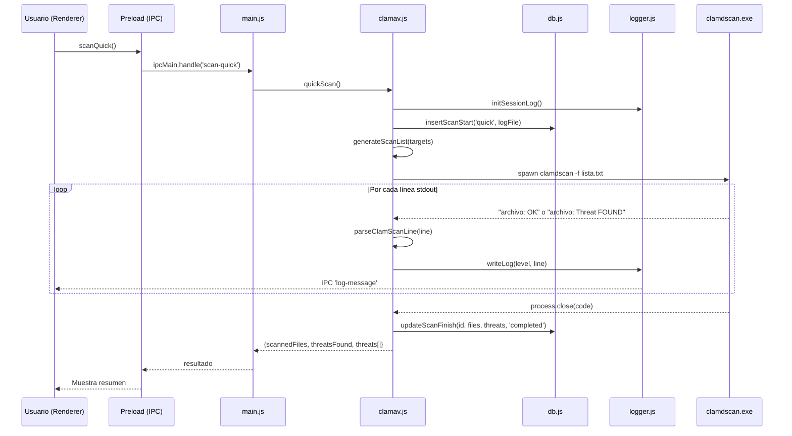
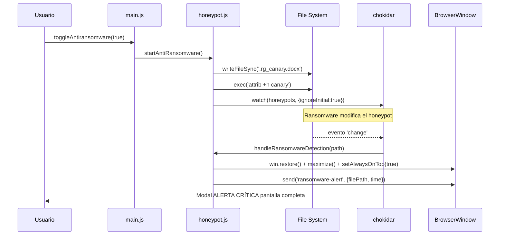
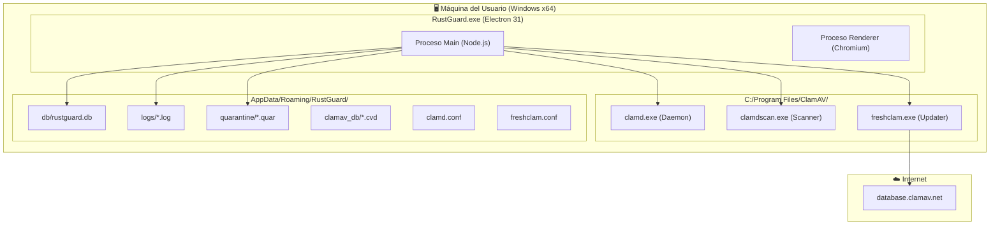
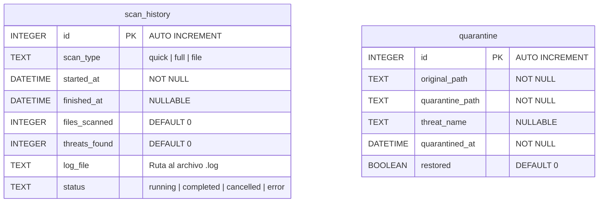

**UNIVERSIDAD PRIVADA DE TACNA**

**FACULTAD DE INGENIERIA**

**Escuela Profesional de Ingeniería de Sistemas**

**Proyecto de Antivirus**

Curso: *Calidad y Pruebas de Software*

Docente: *Mag. Patrick Cuadros Quiroga*

Integrantes:

***LLica Mamani, Jimmy Mijair (2023076789)***

***Sierra Ruiz, Iker Alberto (2023077090)***

**Tacna – Perú**

***2026***

Sistema *RustGuard Antivirus*

Informe de Arquitectura

Versión *2.0*

| CONTROL DE VERSIONES | | | | |
|:---:|:---|:---|:---|:---|
| Versión | Hecha por | Revisada por | Aprobada por | Fecha | Motivo |
| 1.0 | Sierra Ruiz, Iker Alberto | LLica Mamani, Jimmy Mijair | Sierra Ruiz, Iker Alberto | 02/06/2026 | Versión Inicial |
| 2.0 | Equipo RustGuard | Mag. Patrick Cuadros Quiroga | Equipo RustGuard | 04/07/2026 | Arquitectura completa con Modelo C4 |

# **INDICE GENERAL**

[1. Introducción](#1-introducción)

[2. Representación Arquitectónica - Modelo C4](#2-representación-arquitectónica---modelo-c4)

&nbsp;&nbsp;[2.1 Diagrama de Contexto (Nivel 1)](#21-diagrama-de-contexto-nivel-1)

&nbsp;&nbsp;[2.2 Diagrama de Contenedores (Nivel 2)](#22-diagrama-de-contenedores-nivel-2)

&nbsp;&nbsp;[2.3 Diagrama de Componentes (Nivel 3)](#23-diagrama-de-componentes-nivel-3)

[3. Vista de Procesos](#3-vista-de-procesos)

&nbsp;&nbsp;[3.1 Secuencia de Arranque](#31-secuencia-de-arranque)

&nbsp;&nbsp;[3.2 Secuencia de Escaneo](#32-secuencia-de-escaneo)

&nbsp;&nbsp;[3.3 Secuencia Anti-Ransomware](#33-secuencia-anti-ransomware)

[4. Vista de Despliegue](#4-vista-de-despliegue)

[5. Vista de Datos](#5-vista-de-datos)

[6. Restricciones de Diseño](#6-restricciones-de-diseño)

[7. Patrones Arquitectónicos](#7-patrones-arquitectónicos)

[8. Decisiones Arquitectónicas](#8-decisiones-arquitectónicas)

## 1. Introducción

El presente **Informe de Arquitectura** documenta las decisiones de diseño estructural del sistema **RustGuard Antivirus**, una aplicación de escritorio construida con Electron.js y React 19 que integra el motor ClamAV. La arquitectura sigue un modelo de **dos procesos aislados** (Main y Renderer) comunicados exclusivamente por IPC, conforme al patrón de seguridad de Electron con `contextIsolation: true`.

---

## 2. Representación Arquitectónica - Modelo C4

### 2.1 Diagrama de Contexto (Nivel 1)

### 2.2 Diagrama de Contenedores (Nivel 2)

### 2.3 Diagrama de Componentes (Nivel 3)

---

## 3. Vista de Procesos

### 3.1 Secuencia de Arranque

### 3.2 Secuencia de Escaneo

### 3.3 Secuencia Anti-Ransomware

---

## 4. Vista de Despliegue

---

## 5. Vista de Datos

---

## 6. Restricciones de Diseño

| Restricción | Justificación |
| :--- | :--- |
| **Context Isolation obligatorio** | `contextIsolation: true` + `nodeIntegration: false` para prevenir ataques XSS en el Renderer. |
| **Comunicación exclusiva por IPC** | Todo acceso a Node.js APIs pasa por `preload.cjs` → `contextBridge.exposeInMainWorld()`. |
| **Spawn asíncrono para ClamAV** | `child_process.spawn()` evita bloquear el event loop de Node.js durante escaneos largos. |
| **SQLite WAL mode** | Garantiza integridad de datos ante cierres inesperados de la aplicación. |
| **Directorios en userData** | Todos los datos persistentes (DB, logs, cuarentena, firmas) residen en `app.getPath('userData')` para portabilidad. |

---

## 7. Patrones Arquitectónicos

| Patrón | Aplicación en RustGuard |
| :--- | :--- |
| **Broker (IPC Broker)** | `main.js` actúa como broker central que recibe mensajes IPC del Renderer y los despacha a los módulos apropiados (clamav, quarantine, watcher, honeypot). |
| **Observer** | `chokidar` implementa el patrón Observer para monitorear cambios en el file system. `BrowserWindow.webContents.send()` implementa pub/sub para notificar al Renderer. |
| **Queue (Cola)** | `watcher.js` encola archivos detectados y los procesa secuencialmente (`processQueue()`) para evitar saturar ClamAV con múltiples escaneos simultáneos. |
| **Façade** | `preload.cjs` actúa como fachada que abstrae 30+ llamadas IPC en una API limpia (`window.electronAPI`). |
| **Fail-Safe** | Si ClamAV no está instalado, el sistema no crashea; retorna resultado vacío y registra el error. Si clamd no responde, el timeout de 15s resuelve la promesa como fallback. |
| **Repository** | `db.js` centraliza todas las operaciones CRUD de SQLite, exponiendo funciones puras (`insertScanStart`, `updateScanFinish`, etc.) sin exponer el objeto `db` directamente. |

---

## 8. Decisiones Arquitectónicas

| ID | Decisión | Alternativas Evaluadas | Justificación |
| :---: | :--- | :--- | :--- |
| AD-01 | Usar `clamdscan` (daemon) en lugar de `clamscan` (standalone) | clamscan recarga firmas en cada ejecución (~15s de startup) | clamdscan se conecta al daemon que ya tiene las firmas en RAM, reduciendo el tiempo de escaneo por archivo a milisegundos. |
| AD-02 | Generar lista de archivos antes de invocar clamdscan (`-f flag`) | Pasar directorio directamente a clamdscan | Permite cancelación granular durante la fase de recopilación y evita que clamdscan aborte por archivos inaccesibles. |
| AD-03 | Usar `better-sqlite3` sincrónico en lugar de un ORM async | Sequelize, TypeORM, knex | SQLite es single-threaded por naturaleza. `better-sqlite3` es el driver más rápido para Node.js y el modo sincrónico simplifica la lógica de transacciones sin overhead de promesas. |
| AD-04 | Ventana Frameless con Titlebar personalizado | Frame nativo del S.O. | Permite un diseño visual consistente con el tema oscuro premium y controles de ventana integrados en la marca RustGuard. |
| AD-05 | Honeypots con `chokidar` en lugar de Windows API (`ReadDirectoryChangesW`) | API nativa de Windows | `chokidar` es cross-platform y ya es dependencia del proyecto para el módulo de Tiempo Real, evitando duplicar la lógica de file watching. |

---

## Bibliografía

1. Richards, M., & Ford, N. (2020). *Fundamentals of Software Architecture*. O'Reilly Media.
2. Brown, S. (2021). *The C4 Model for Visualising Software Architecture*. Recuperado de https://c4model.com/
3. Electron. (2025). *Process Model*. Recuperado de https://www.electronjs.org/docs/latest/tutorial/process-model
4. SQLite. (2025). *Write-Ahead Logging*. Recuperado de https://www.sqlite.org/wal.html
