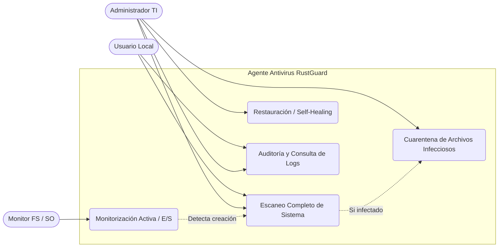
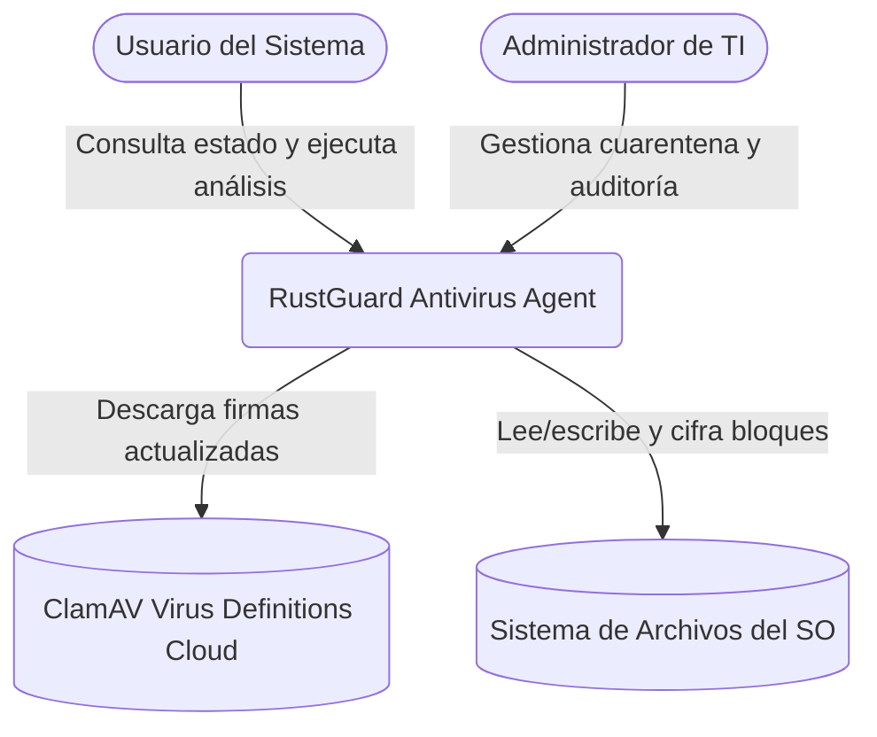
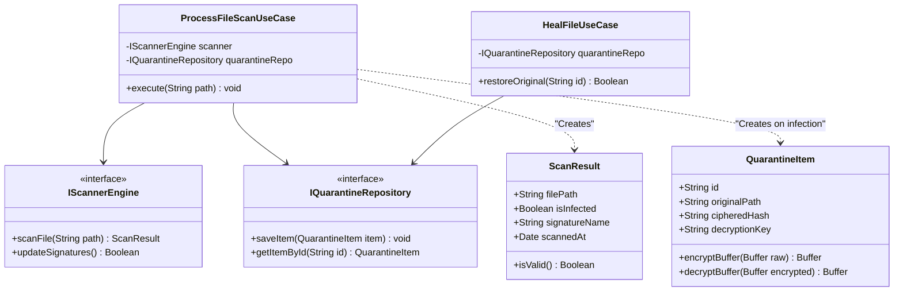
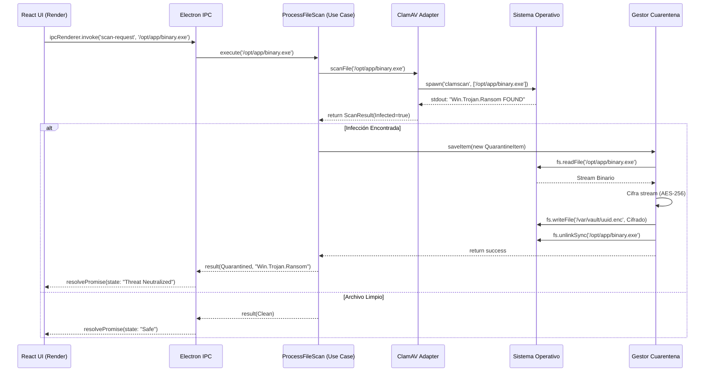

<center>


**UNIVERSIDAD PRIVADA DE TACNA**

**FACULTAD DE INGENIERIA**

**Escuela Profesional de Ingeniería de Sistemas**

**Proyecto de Antivirus**

Curso: *Calidad y Pruebas de Software*

Docente: *Mag. Patrick Cuadros Quiroga*

Integrantes:

***LLica Mamani, Jimmy Mijair (2023076789)***

***Sierra Ruiz, Iker Alberto (2023077090)***

**Tacna – Perú**

***2026***

</center>

<div style="page-break-after: always; visibility: hidden"></div>

Sistema *RustGuard Antivirus*

Informe de Arquitectura de Software

Versión *2.0*

| CONTROL DE VERSIONES | | | | |
|:---:|:---|:---|:---|:---|
| Versión | Hecha por | Revisada por | Aprobada por | Fecha | Motivo |
| 1.0 | Sierra Ruiz, Iker Alberto | LLica Mamani, Jimmy Mijair | Sierra Ruiz, Iker Alberto | 02/06/2026 | Versión Inicial |
| 2.0 | Equipo RustGuard | Mag. Patrick Cuadros Quiroga | Equipo RustGuard | 04/07/2026 | Arquitectura Multi-Plataforma (Integración Final) |

<div style="page-break-after: always; visibility: hidden"></div>

# **ÍNDICE GENERAL**

1. [Introducción y Metas Arquitectónicas](#1-introducción-y-metas-arquitectónicas)
2. [Vista de Casos de Uso (Interacciones Principales)](#2-vista-de-casos-de-uso-interacciones-principales)
3. [Vista Lógica: Modelo C4 (Contexto y Contenedores)](#3-vista-lógica-modelo-c4-contexto-y-contenedores)
4. [Vista Estructural: Diseño de Clases y Clean Architecture](#4-vista-estructural-diseño-de-clases-y-clean-architecture)
5. [Vista de Procesos: Comportamiento Dinámico](#5-vista-de-procesos-comportamiento-dinámico)
6. [Vista de Despliegue e Infraestructura (Nivel 4)](#6-vista-de-despliegue-e-infraestructura-nivel-4)
7. [Gestión de Datos y Persistencia](#7-gestión-de-datos-y-persistencia)

<div style="page-break-after: always; visibility: hidden"></div>

# 1. Introducción y Metas Arquitectónicas

### 1.1 Propósito
El presente Documento de Arquitectura de Software (SAD) define de forma exhaustiva las directrices estructurales, los patrones de diseño subyacentes y el modelo de despliegue de **RustGuard - Agente Antivirus y Self-Healing**. Su propósito es servir como una guía técnica vinculante para los equipos de ingeniería, asegurando que la implementación cumpla rigurosamente con los atributos de calidad definidos y la filosofía de **Clean Architecture** adoptada para el sistema.

### 1.2 Restricciones Arquitectónicas
* **Dependencia de ClamAV Daemon:** El análisis heurístico principal delega su ejecución algorítmica al binario `clamscan` de ClamAV, imponiendo una dependencia estricta del entorno local del Sistema Operativo anfitrión.
* **Separación de Procesos (IPC):** El framework Electron exige una separación arquitectónica estricta entre el *Render Process* (React 19) y el *Main Process* (Node.js). Ningún módulo web puede acceder directamente al sistema de archivos local (`fs`), limitando las llamadas exclusivamente a través del puente criptográficamente seguro (`contextBridge`).
* **Sistemas Operativos Soportados:** Dado que el orquestador backend depende de procesos nativos de administración (`child_process.spawn`), la plataforma de despliegue exige sistemas basados en distribuciones estándar Windows (NTFS) o Linux (Debian/Ubuntu/RedHat) con permisos elevados.

### 1.3 Atributos de Calidad (Ilities)
* **Seguridad (Security):** Garantizada a través del cifrado en reposo (AES-256) en la bóveda de cuarentena, y del principio de menor privilegio en las invocaciones IPC para prevenir inyecciones desde la UI hacia el motor de sistema (Tamper Protection).
* **Rendimiento (Performance):** La arquitectura delega el costoso escaneo profundo a procesos en segundo plano de manera asíncrona, manteniendo el hilo de renderizado web a 60 FPS sin afectar la experiencia del usuario.
* **Mantenibilidad (Maintainability):** Al aplicar *Clean Architecture*, la lógica del negocio (casos de uso de escaneo y restauración) se encuentra completamente agnóstica a los detalles de interfaz (React) y persistencia (SQLite/Archivos). Esto permite cambiar bibliotecas externas (ej. migrar SQLite a PostgreSQL) sin reescribir el núcleo del agente.

---

# 2. Vista de Casos de Uso (Interacciones Principales)

### 2.1 Descripción de Actores y Casos Core
La solución orquesta flujos asíncronos en los que intervienen diversos actores para garantizar un entorno *Zero-Trust*:
1. **Administrador de Seguridad:** Realiza acciones directivas como auditorías y forzado de restauraciones (*Self-Healing*).
2. **Usuario Local:** Interactúa visualmente para solicitar escaneos bajo demanda y revisar el estatus de salud del sistema.
3. **FS Monitor (Sistema):** Actor pasivo que inyecta eventos de E/S del núcleo del sistema operativo.

### 2.2 Diagrama de Casos de Uso



---

# 3. Vista Lógica: Modelo C4 (Contexto y Contenedores)

### 3.1 Nivel 1: Diagrama de Contexto del Sistema



**Descripción del Nivel 1:**
El Agente RustGuard actúa como el punto focal de seguridad en el *endpoint*. Los usuarios interactúan con él para validar archivos locales. El agente se comunica externamente con servidores remotos de firmas (ClamAV Cloud) para actualizar heurísticas, y se integra a un nivel muy profundo (Kernel level / I/O level) con el Sistema de Archivos local para ejecutar la inspección e implementación del *Self-Healing* de los activos de la organización.

### 3.2 Nivel 2: Diagrama de Contenedores

```mermaid
graph TB
    User([Usuario del Sistema])

    subgraph RustGuard Desktop App
        UI[GUI Application Container<br/>React 19, TailwindCSS]
        
        IPC_Bus[IPC Bridge<br/>ContextBridge / Serialización JSON]
        
        Core[Core Logic Container<br/>Node.js / Clean Architecture]
        
        LocalDB[(Embedded Database<br/>SQLite3 / JSON Store)]
        Vault[(Quarantine Vault<br/>Cifrado AES-256)]
    end

    ClamAV[ClamAV Daemon<br/>Binario Nativo C/C++]

    User -->|Interactúa (Clics/Rutas)| UI
    UI <-->|Promesas Asíncronas| IPC_Bus
    IPC_Bus <-->|Comandos| Core
    
    Core -->|Registra telemetría| LocalDB
    Core -->|Cifra y mueve binarios| Vault
    Core <-->|Spawnea procesos OS| ClamAV
```

**Descripción del Nivel 2:**
El sistema está fraccionado en contenedores lógicos dentro del mismo ecosistema Electron. La **GUI (React)** no tiene conocimiento del sistema; simplemente dibuja estados. El **Core Logic (Node.js)** representa el núcleo y ejecuta los casos de uso. Delega la persistencia de los archivos cifrados al contenedor de **Vault**, y la búsqueda de firmas malignas al **Demonio ClamAV** nativo del sistema. La comunicación inter-contenedor de la UI al Core se realiza por medio del canal **IPC Bridge**.

---

# 4. Vista Estructural: Diseño de Clases y Clean Architecture

### 4.1 Diagrama de Clases del Dominio y Casos de Uso
El siguiente diagrama detalla la aplicación estricta de *Clean Architecture*, evidenciando cómo el núcleo de la aplicación (Entidades y Casos de Uso) no depende de ningún *framework* externo.



### 4.2 Mapeo de Capas
El proyecto estructura sus directorios bajo el paradigma de cebolla (*Onion Architecture*):
* **`src/domain/` (Entidades):** Contiene los modelos base (`ScanResult.ts`, `QuarantineItem.ts`). Cero dependencias (librerías externas prohibidas).
* **`src/use-cases/` (Interactors):** Contiene la orquestación del flujo de negocio. Inyecta dependencias a través de constructores (Inversión de Control).
* **`src/interfaces/` (Gateways):** Contiene los adaptadores que conectan el dominio con el mundo exterior (`ClamAVScannerAdapter.ts`, `SQLiteQuarantineRepo.ts`).
* **`src/infrastructure/` (Frameworks):** Código específico de Electron (Main process, IPC handlers) y React (Componentes UI). 

---

# 5. Vista de Procesos: Comportamiento Dinámico

### 5.1 Diagrama de Secuencia de un Flujo Crítico
El siguiente diagrama ilustra el flujo crítico asíncrono de **Detección de infección y reparación automática (Cuarentena y Self-Healing preventivo)**.



---

# 6. Vista de Despliegue e Infraestructura (Nivel 4)

### 6.1 Diagrama de Despliegue

```mermaid
graph TD
    subgraph Workstation / Servidor On-Premise (Linux/Windows)
        subgraph Electron Runtime Env
            AppBinary[RustGuard.exe / .AppImage]
        end
        
        subgraph System Daemons
            ClamAV_Service[Demonio ClamAV Service<br/>Port: TCP 3310 (opcional)]
        end
        
        subgraph Filesystem
            Logs[/var/log/rustguard/]
            VaultVol[/var/opt/rustguard/vault/]
        end
        
        AppBinary -->|Spawns / Local socket| ClamAV_Service
        AppBinary -->|Escribe logs| Logs
        AppBinary -->|Mueve y cifra| VaultVol
    end

    subgraph Cloud Infrastructure (AWS - Terraform)
        CI_CD[GitHub Actions Runner]
        TelemetryDB[(AWS DynamoDB / RDS<br/>Futura Telemetría)]
    end

    CI_CD -.->|Despliega binarios firmados| Workstation
    AppBinary -.->|HTTPS / TLS 1.3| TelemetryDB
```

### 6.2 Especificaciones de Infraestructura
* **Servidores On-Premise/Workstations:** Requieren un mínimo de 2 vCPUs y 4 GB de RAM. Debe haber un binario nativo (compilado en C) de ClamAV configurado y disponible en el `PATH` del sistema.
* **Sistema de Archivos y Permisos:** El ejecutable del Agente RustGuard (Electron Main Process) debe operar bajo un nivel de privilegios *root* en Linux o *Administrador* en Windows, permitiéndole interceptar operaciones E/S en los puntos de montaje nativos (Samba/NFS) para el monitoreo activo.
* **Redes y Protocolos:** Todo egreso de información de telemetría (futura) operará por el puerto TCP 443 (HTTPS), con cifrado TLS 1.3.

---

# 7. Gestión de Datos y Persistencia

La arquitectura requiere una persistencia dual extremadamente robusta para manejar la auditoría de seguridad y el salvamento de archivos:

1. **Gestión de Cuarentena (Blobs Cifrados):** 
   Los archivos maliciosos no se borran; se almacenan como binarios ofuscados (`*.enc`) en un subdirectorio aislado del host (`/var/opt/rustguard/vault/`). Se utiliza el algoritmo de clave simétrica estandarizado **AES-256-CBC**, derivando la clave criptográficamente a partir de las credenciales del sistema operativo mediante el módulo nativo `crypto` de Node.
2. **Registro Relacional de Eventos (Metadatos):** 
   Los metadatos correspondientes (hash SHA-256 original, fecha de infección, nombre de la firma) se persisten en una base de datos local empaquetada (SQLite 3), lo que asegura transaccionalidad ACID y soporte avanzado para consultas a través del Panel de Control de la UI.
3. **Manejo de Concurrencia:** 
   El agente implementa un mecanismo de bloqueo tipo *Mutex* a nivel de archivo durante la cuarentena para prevenir *Race Conditions*, donde el sistema operativo intente modificar o ejecutar el archivo malicioso simultáneamente mientras RustGuard lo está cifrando para su traslado.
