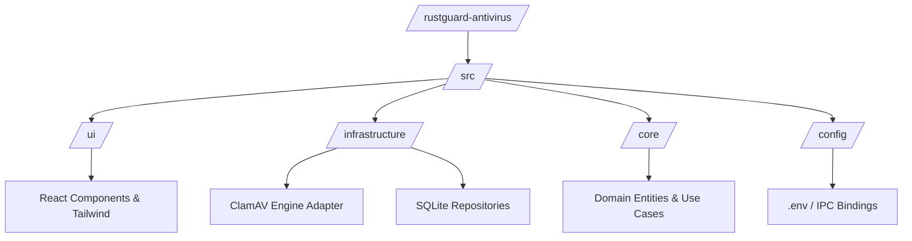

<center>


**UNIVERSIDAD PRIVADA DE TACNA**

**FACULTAD DE INGENIERIA**

**Escuela Profesional de Ingeniería de Sistemas**

**Proyecto de Antivirus**

Curso: *Calidad y Pruebas de Software*

Docente: *Mag. Patrick Cuadros Quiroga*

Integrantes:

***LLica Mamani, Jimmy Mijair (2023076789)***

***Sierra Ruiz, Iker Alberto (2023077090)***

**Tacna – Perú**

***2026***

</center>

<div style="page-break-after: always; visibility: hidden"></div>

Sistema *RustGuard Antivirus*

Documentación de Proyecto y Manual Técnico

Versión *2.0*

| CONTROL DE VERSIONES | | | | |
|:---:|:---|:---|:---|:---|
| Versión | Hecha por | Revisada por | Aprobada por | Fecha | Motivo |
| 1.0 | Sierra Ruiz, Iker Alberto | LLica Mamani, Jimmy Mijair | Sierra Ruiz, Iker Alberto | 02/06/2026 | Versión Inicial |
| 2.0 | Equipo RustGuard | Mag. Patrick Cuadros Quiroga | Equipo RustGuard | 04/07/2026 | Manual consolidado de la Suite Omnicanal |

<div style="page-break-after: always; visibility: hidden"></div>

# Manual Técnico del Sistema: Agente Antivirus y Self-Healing (RustGuard)

## 1. Arquitectura del Sistema y Diseño de Software

### 1.1 Visión General
El agente RustGuard está diseñado utilizando el paradigma de **Clean Architecture** estructurado en un entorno de Electron y Node.js. Esto garantiza una separación estricta entre la capa de Interfaz de Usuario (React 19), la orquestación del negocio (Casos de Uso) y la Infraestructura subyacente (Sistema de archivos local y daemon de ClamAV). Toda comunicación inter-procesos se securiza a través del `contextBridge`, evitando inyecciones arbitrarias de código.

### 1.2 Estructura del Código Fuente
El repositorio sigue un esquema de directorios modular. A continuación, se presenta la topología del código fuente:


* `/core`: Lógica agnóstica de negocio y entidades puras (Modelos de Infección, Validadores).
* `/infrastructure`: Implementaciones técnicas concretas, acceso a bases de datos y envoltorios (wrappers) de llamadas a CLI nativas.
* `/ui`: Todo el ecosistema web React, compilado vía Vite.
* `/config`: Variables de compilación y orquestación del puente IPC de Electron.

## 2. Requisitos del Entorno de Desarrollo y Producción

### 2.1 Requisitos de Hardware
* **CPU:** Procesador x86_64 o ARM64 con al menos 2 núcleos físicos (Intel Core i3 gen 8+ o equivalente).
* **Memoria RAM:** 
  * Mínima: 2 GB (Operación pasiva).
  * Recomendada: 4 GB (Para escaneos Deep-Scan multi-hilo concurrentes).
* **Almacenamiento:** 500 MB libres para binarios y espacio dinámico (SSD recomendado) para alojar la Bóveda de Cuarentena local y firmas virales.

### 2.2 Requisitos de Software y Sistema Operativo
* **Sistema Operativo:** Windows 10/11 (NTFS) o Distribuciones Linux modernas (Ubuntu 22.04 LTS / Debian 12) con kernel >= 5.15.
* **Intérprete Core:** Node.js v20.x LTS o superior.
* **Dependencia Crítica:** `clamav` y `clamav-daemon` (v0.103+) instalado a nivel de host.

### 2.3 Dependencias de Bibliotecas (Libraries)
Las dependencias se gestionan estrictamente a través de `package.json` utilizando NPM. Principales librerías empleadas:
* **UI/UX:** `react`, `react-dom`, `tailwindcss`, `framer-motion`.
* **Seguridad y Cifrado:** `crypto` (nativo de Node), `sqlite3`.
* **Testing:** `vitest`, `@playwright/test`, `@stryker-mutator/core`.

## 3. Instalación, Configuración y Despliegue Técnico

### 3.1 Preparación del Entorno Linux
Para garantizar que el motor ClamAV pueda interactuar correctamente con el puente Node.js, es imperativo aprovisionar las dependencias del OS.

```bash
# Actualizar repositorios e instalar Node.js 20 y ClamAV
sudo apt update && sudo apt upgrade -y
curl -fsSL https://deb.nodesource.com/setup_20.x | sudo -E bash -
sudo apt-get install -y nodejs clamav clamav-daemon build-essential

# Descargar las firmas virales actualizadas
sudo freshclam

# Configurar permisos para que el usuario pueda escribir en la bóveda
sudo mkdir -p /var/opt/rustguard/vault
sudo chown -R $USER:$USER /var/opt/rustguard/vault
```

### 3.2 Configuración de Variables de Entorno
El sistema requiere el archivo `.env` en la raíz del proyecto para definir la criptografía local y rutas.

| Variable | Descripción Técnica | Ejemplo |
|:---|:---|:---|
| `VAULT_PATH` | Ruta absoluta para almacenar binarios bloqueados. | `/var/opt/rustguard/vault` |
| `CLAMAV_BIN_PATH` | Ruta del ejecutable clamscan en el SO. | `/usr/bin/clamscan` |
| `AES_SECRET_KEY` | Llave en formato Hex de 256 bits para ofuscación. | `a1b2c3d4... (64 chars)` |

**Ejemplo `rustguard.env`:**
```env
# RustGuard Agent Configuration
NODE_ENV=production
VAULT_PATH=/var/opt/rustguard/vault
CLAMAV_BIN_PATH=/usr/bin/clamscan
AES_SECRET_KEY=9a3b5c7d...e2f4
```

### 3.3 Despliegue de Servicios (Services / Daemons)
Para asegurar que el agente persista ante reinicios, en entornos Linux *headless* se recomienda la inicialización a través de PM2 o `systemd`. Si el despliegue es gráfico, el binario `.AppImage` configurará su propio *autostart*.

Creación del servicio SystemD:
```bash
# /etc/systemd/system/rustguard.service
[Unit]
Description=RustGuard Antivirus IPC Daemon
After=network.target clamav-daemon.service

[Service]
Type=simple
User=root
WorkingDirectory=/opt/rustguard/
ExecStart=/usr/bin/node /opt/rustguard/dist/main/index.js
Restart=on-failure
EnvironmentFile=/opt/rustguard/.env

[Install]
WantedBy=multi-user.target
```
Habilitar: `sudo systemctl enable --now rustguard.service`

## 4. Flujos de Datos y Procesamiento Interno

### 4.1 Inicialización del Sistema
Al ejecutar el binario (o servicio):
1. **Bootstrap del Main Process:** Electron inicializa el motor de base de datos SQLite y carga en memoria las llaves AES desde el entorno seguro.
2. **Preload:** El script `preload.js` inyecta las funciones permitidas al objeto `window.rustguardAPI` del DOM.
3. **FS Watcher:** El hilo secundario invoca `fs.watch()` sobre los directorios `/home/$USER/Downloads` y equivalentes para captar eventos E/S en tiempo real.

### 4.2 Procesamiento de Tareas Críticas
**Algoritmo de Escaneo, Cuarentena y Self-Healing:**
1. Se detecta un archivo nuevo (ej. `payload.sh`).
2. Se ejecuta asincrónicamente: `child_process.spawn('clamscan', ['/ruta/payload.sh'])`.
3. Si el *stdout* hace *match* con `FOUND`, se bloquea el hilo (`mutex`).
4. **Cifrado en Vuelo (Piping):** El *buffer* crudo de `payload.sh` se lee, se pasa por un `crypto.createCipheriv('aes-256-cbc')`, y se escribe en un archivo UUID `.enc` en la carpeta Vault.
5. Se aplica `fs.unlinkSync()` para erradicar el *payload* original.
6. **Self-Healing:** Si se decreta un falso positivo en la UI, el proceso se revierte descifrando el archivo con la clave estática local y moviéndolo a su carpeta de origen.

## 5. Mantenimiento, Registro de Logs y Resolución de Problemas (Troubleshooting)

### 5.1 Estrategia de Logs (Logging)
El sistema genera volcados rotativos manejados internamente en formato NDJSON.
* **Ubicación:** `~/.config/RustGuard/logs/` o `%APPDATA%\RustGuard\logs\`.
* **Niveles:**
  * `INFO`: Arranques, actualizaciones exitosas de firmas de ClamAV.
  * `WARN`: Exclusiones de ruta solapadas, timeout de lectura.
  * `ERROR`: Excepciones IPC no controladas, fallas nativas al borrar archivos (Permisos).

### 5.2 Rutina de Mantenimiento
Se aconseja configurar un *CronJob* o *Scheduled Task* mensual:
1. `freshclam` (Si no se ha activado la tarea asíncrona automática).
2. Purga de logs antiguos: `find ~/.config/RustGuard/logs/ -mtime +30 -type f -delete`.
3. Revisión del tamaño de la Bóveda de cuarentena.

### 5.3 Matriz de Errores Técnicos

| Código / Mensaje de Error | Causa Raíz Probable | Solución Técnica |
| :--- | :--- | :--- |
| `ERR_CLAMAV_NOT_FOUND` | El binario de ClamAV no está mapeado en el `PATH` o `CLAMAV_BIN_PATH` es erróneo. | `export PATH=$PATH:/usr/bin` o actualizar el archivo `.env`. |
| `EACCES: permission denied, unlink` | El archivo malicioso fue tomado por otro proceso del SO o carece de permisos elevados. | Ejecutar RustGuard con elevación (Run as Admin / Sudo) o finalizar el subproceso bloqueante con `lsof`. |
| `IPC_TIMEOUT_EXCEEDED` | Archivo gigantesco escaneado forzó un timeout en el Promise. | Aumentar el límite del timeout en la config de Electron o evitar directorios masivos como *node_modules*. |
| `BAD_DECRYPT` | Corrupción de la bóveda o llave AES rotada indebidamente. | El archivo no puede ser recuperado. Revisar consistencia de `AES_SECRET_KEY` en entorno. |

<div style="page-break-after: always; visibility: hidden"></div>

# Manual de Usuario y Operación: Sistema Antivirus y Self-Healing (RustGuard)

## 1. Introducción y Propósito del Sistema

### 1.1 Bienvenida
¡Bienvenido a RustGuard! Este sistema ha sido diseñado para proteger su estación de trabajo de manera silenciosa y eficiente. RustGuard actúa como un escudo protector en tiempo real, monitoreando los archivos que descarga y procesa para detectar amenazas antes de que puedan dañar su equipo. Gracias a su interfaz amigable, no necesita ser un experto en ciberseguridad para mantener su sistema limpio; el sistema aísla el peligro automáticamente y le permite recuperar archivos si ocurren detecciones por error.

### 1.2 Requisitos Previos para el Uso
Antes de comenzar, asegúrese de tener:
* Acceso a su cuenta de usuario en el sistema operativo. No es estrictamente necesario ser administrador para abrir la aplicación, pero sí para realizar escaneos profundos de sistema.
* El ícono de **RustGuard Antivirus** disponible en su menú de inicio o escritorio.

## 2. Inicio de Sesión y Ejecución de la Aplicación

### 2.1 Cómo Iniciar el Sistema
1. Ubique el ícono de **RustGuard** en su Escritorio o menú de inicio.
2. Haga **doble clic** sobre el ícono.
3. El sistema se abrirá mostrando directamente el panel de estado. No hay pantallas de carga prolongadas debido a su diseño ligero.

### 2.2 Pantalla de Autenticación / Acceso Inicial
RustGuard está vinculado directamente a su sesión de sistema operativo. No se le pedirá un usuario o contraseña adicional para visualizar el estado. Sin embargo, si intenta restaurar un archivo de la cuarentena, el sistema operativo podría solicitarle su PIN o contraseña local por seguridad.

## 3. Guía de la Interfaz de Usuario (Recorrido Visual)

### 3.1 Panel Principal (Dashboard / Ventana de Inicio)
Al abrir la aplicación, verá la pantalla principal dividida en tres áreas clave:
* **Barra Lateral Izquierda:** Contiene los menús de navegación: **Inicio**, **Escáner**, **Cuarentena** y **Registros**.
* **Área Central de Estado:** Un gran escudo visual. Si está en color **Verde**, su equipo está protegido. Si está en **Rojo**, se requiere su atención (amenaza detectada).
* **Barra Inferior:** Muestra la versión actual de las firmas de virus y el estado de la conexión a los servicios de protección.

### 3.2 Componentes de la Interfaz
* **Botón "Escaneo Rápido":** Realiza una revisión veloz de las carpetas más vulnerables (Descargas, Documentos).
* **Botón "Escaneo Completo":** Revisa minuciosamente todo el disco duro.
* **Pestaña "Cuarentena":** Abre la bóveda segura donde se almacenan los archivos neutralizados.
* **Caja de Búsqueda de Logs:** Le permite filtrar rápidamente los eventos pasados ingresando palabras clave como "peligro" o una fecha específica.

## 4. Guías de Operación Paso a Paso (Procedimientos Frecuentes)

### 4.1 Procedimiento A: Cómo realizar un escaneo manual e inmediato
Si sospecha de un archivo descargado recientemente, siga estos pasos:
1. Abra RustGuard y diríjase a la pestaña **Escáner** en el menú izquierdo.
2. Haga clic en el botón **Seleccionar Archivo / Carpeta**.
3. Se abrirá una ventana de su sistema operativo; busque y seleccione el archivo sospechoso.
4. Haga clic en **Analizar Ahora**.
5. Espere a que la barra de progreso llegue al 100%. Si el archivo es seguro, verá una alerta verde. Si es peligroso, el sistema lo moverá inmediatamente a la cuarentena y le mostrará un aviso rojo.

### 4.2 Procedimiento B: Cómo consultar el historial de eventos (Logs)
Para auditar qué ha hecho el antivirus mientras usted no estaba:
1. Haga clic en la pestaña **Registros** en la barra lateral.
2. Verá una tabla con todos los eventos recientes. 
3. Haga clic en el botón **Filtrar por:** y seleccione **Solo Amenazas** para ocultar los escaneos limpios.
4. (Opcional) Si desea guardar este reporte, haga clic en el botón **Exportar PDF** situado en la esquina superior derecha.

### 4.3 Procedimiento C: Cómo restaurar el estado de un archivo (Self-Healing)
Si un archivo legítimo fue bloqueado por error (falso positivo):
1. Vaya a la pestaña **Cuarentena**.
2. Busque en la lista el archivo que necesita recuperar y selecciónelo haciendo un clic.
3. Presione el botón **Restaurar Archivo Original**.
4. Confirme la alerta de seguridad haciendo clic en **Sí, estoy seguro**.
5. El archivo regresará instantáneamente a la carpeta donde estaba antes de ser bloqueado.

## 5. Glosario de Alertas, Mensajes de Sistema y Preguntas Frecuentes (FAQ)

### 5.1 Guía de Mensajes y Notificaciones

| Mensaje en Pantalla | Significado (Qué significa) | Acción del Usuario (Qué debe hacer) |
| :--- | :--- | :--- |
| **"Amenaza Neutralizada"** | El sistema detectó un virus y lo ha cifrado en la cuarentena. | No requiere acción. Puede revisar la pestaña Cuarentena para más detalles. |
| **"Bases de datos obsoletas"** | Las firmas de virus tienen más de 7 días sin actualizarse. | Verifique su conexión a internet y haga clic en **Actualizar Firmas**. |
| **"Permisos Insuficientes"** | Intentó escanear o restaurar un directorio protegido por el sistema (ej. System32). | Reinicie la aplicación haciendo clic derecho en el ícono y seleccionando "Ejecutar como Administrador". |

### 5.2 Preguntas Frecuentes (FAQ)

* **¿Qué hago si la aplicación indica que el "Motor está desconectado"?**
  Esto significa que el servicio en segundo plano se ha detenido. Cierre la ventana de la aplicación y vuelva a abrirla. Si el problema persiste, reinicie el computador.
  
* **¿Dónde se guardan los archivos bloqueados? ¿Pueden infectar mi PC?**
  Los archivos se guardan en una "Bóveda" interna secreta. Están totalmente cifrados y desarmados; es imposible que infecten su PC mientras estén ahí.

* **¿Necesito estar conectado a internet para que el antivirus funcione?**
  ¡No! La detección de amenazas funciona perfectamente sin internet. Solo necesita internet temporalmente una vez por semana para descargar las nuevas vacunas (firmas).

* **El escaneo completo está tardando mucho, ¿puedo seguir trabajando?**
  Sí, RustGuard está diseñado para no congelar su pantalla. Puede minimizar la ventana y continuar usando sus programas normales mientras el escaneo finaliza en segundo plano.
