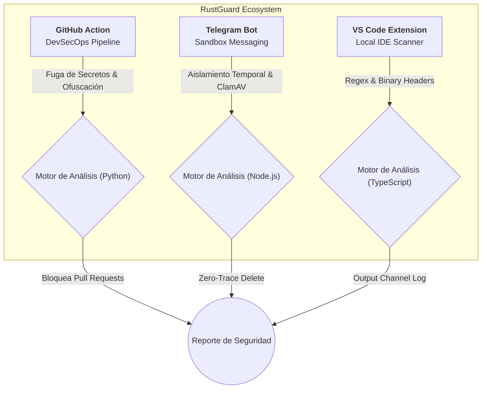

  
  <h1>🛡️ RustGuard Antivirus Suite</h1>
  

    <strong>El Ecosistema Omnicanal de Seguridad Proactiva y Análisis de Malware (Zero-Trace)</strong>
  

  
  
  
  
  

  

    <a href="#-acerca-de-la-suite">Acerca de la Suite</a> •
    <a href="#-arquitectura-del-ecosistema">Arquitectura</a> •
    <a href="#-sub-proyectos-integrados">Proyectos Integrados</a> •
    <a href="#-documentación-oficial-informes">Documentación Formal</a> •
    <a href="#-autores">Autores</a>
  

---

## 📖 Acerca de la Suite

**RustGuard Antivirus** no es un antivirus tradicional de escritorio; es un **ecosistema de seguridad distribuido**. 

Desarrollado como proyecto final integrador, RustGuard traslada la seguridad directamente a los entornos donde el usuario moderno opera diariamente: el repositorio de código, el editor de desarrollo, y el chat de mensajería. Su filosofía se basa en el concepto de *Shift-Left Security* (Seguridad Temprana) y un modelo *Zero-Trace* que asegura que ningún archivo sospechoso persista en la memoria de los servidores por más tiempo del necesario.

---

## 📐 Arquitectura del Ecosistema

La suite está diseñada de manera modular, donde cada cliente opera independientemente utilizando motores híbridos de seguridad (Heurística, Hashes SHA-256, Inspección de Cabeceras PE, e integración con ClamAV).

---

## 🚀 Sub-Proyectos Integrados

El ecosistema RustGuard está conformado por 3 componentes altamente especializados. A continuación, un resumen de cada uno:

### 1. 🐙 RustGuard DevSecOps (GitHub Action)
- **Tecnología:** Python 3.10 (Docker Container).
- **Propósito:** Auditoría pasiva en pipelines CI/CD.
- **Funcionamiento:** Escanea ramas y repositorios completos durante los eventos `push` o `pull_request` en GitHub. Busca credenciales hardcodeadas (AWS, JWT, RSA Keys), detecta código ofuscado (Base64) y payloads remotos. Falla intencionalmente (`exit 1`) si se hallan vulnerabilidades, protegiendo el despliegue del proyecto.

### 2. 🤖 RustGuard Sandbox (Telegram Bot)
- **Tecnología:** Node.js (Telegraf/Node-Telegram-Bot-API) + ClamAV.
- **Propósito:** Filtro de seguridad para usuarios de comunicación instantánea.
- **Funcionamiento:** Escucha eventos de documentos en chats de Telegram. Descarga el archivo de forma aislada, delega el escaneo a un proceso local de *ClamAV* vía shell y responde al usuario de forma inmediata. Elimina obligatoriamente el archivo del disco inmediatamente después (Política Zero-Trace).

### 3. 💻 RustGuard Local Scanner (VS Code Extension)
- **Tecnología:** TypeScript + Node.js (VS Code API).
- **Propósito:** Antivirus autónomo integrado en el IDE sin dependencias externas.
- **Funcionamiento:** Inyecta comandos en el menú contextual del explorador de archivos de VS Code. Escanea archivos pesados validando firmas SHA-256 conocidas (como EICAR), inspecciona los primeros bytes buscando cabeceras ejecutables PE (`MZ`) camufladas, e implementa búsquedas Regex en archivos sospechosos.

---

## 📚 Documentación Oficial (Informes)

Toda la fundamentación de ingeniería de software (requisitos, arquitectura, manuales y diccionarios) está centralizada y disponible en la carpeta de `Informes/`. Puedes consultar los documentos detallados haciendo clic en los siguientes enlaces:

| ID | Documento de Ingeniería | Descripción |
|:---:|:---|:---|
| 📄 | [**FD01 - Informe de Factibilidad**](../Informes/FD01-Informe-Factibilidad.md) | Análisis de viabilidad técnica, operativa, y costo $0. |
| 👁️ | [**FD02 - Visión de Producto**](../Informes/FD02-Informe-Vision.md) | Posicionamiento de mercado, perfiles de usuario y modelo de negocio de la Suite. |
| ⚙️ | [**FD03 - Requerimientos**](../Informes/FD03-Informe-Requerimientos.md) | Especificación de Requerimientos Funcionales (RF) y No Funcionales (RNF) por subsistema. |
| 🏛️ | [**FD04 - Arquitectura**](../Informes/FD04-Informe-Arquitectura.md) | Vistas lógicas, patrones de diseño (Event-Driven, Fail-Fast) e interacción modular. |
| 📖 | [**FD05 - Manual de Proyecto**](../Informes/FD05-Documentacion-y-Manual.md) | **Manual de Usuario** detallado con guías de instalación y uso de la Action, el Bot y la Extensión de VS Code. |
| 🗄️ | [**Diccionario de Datos**](../Informes/Diccionario-de-Datos.md) | Estructuras en memoria, sets de restricción y variables de entorno del sistema No-Relacional. |
| 📏 | [**Estándar de Programación**](../Informes/Estandar-de-Programacion.md) | Normativas y guías de estilos de código aplicados a la suite (PEP-8, TS Strict, y JS Asíncrono). |

> **Nota:** Todos los informes cuentan con control de versiones y fueron redactados bajo el formato unificado del curso.

---

## 👨‍💻 Autores y Créditos

Este ecosistema ha sido desarrollado como proyecto de evaluación para la Universidad Privada de Tacna.

- **Jimmy Mijair LLica Mamani** (2023076789)
- **Iker Alberto Sierra Ruiz** (2023077090)

**Curso:** Calidad y Pruebas de Software (2026)  
**Docente:** Mag. Patrick Cuadros Quiroga  

  <i>"Asegurando el código en cada etapa del desarrollo y despliegue."</i>

