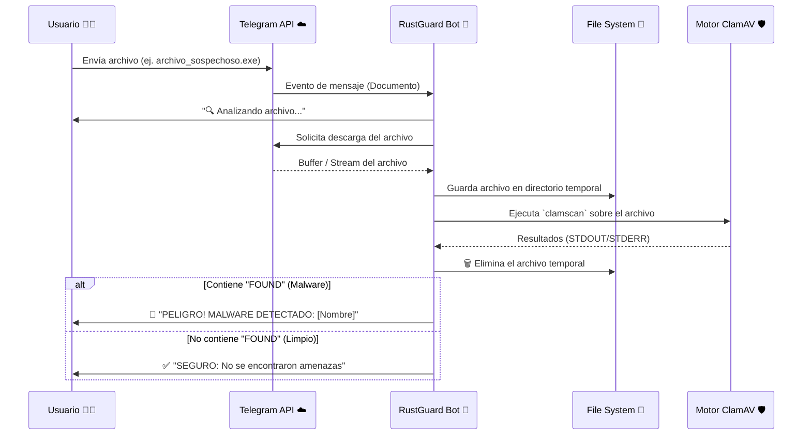

<div align="center">
  <h1>🛡️ RustGuard Telegram Bot</h1>
  <p>
    <strong>Tu centinela personal contra el malware en Telegram, impulsado por ClamAV.</strong>
  </p>
  
  [](https://nodejs.org/)
  [](https://core.telegram.org/bots/api)
  [](https://www.clamav.net/)
  [](https://opensource.org/licenses/MIT)

  <p>
    <a href="#-acerca-del-proyecto">Acerca del Proyecto</a> •
    <a href="#-características">Características</a> •
    <a href="#-cómo-funciona">Cómo Funciona</a> •
    <a href="#-requisitos-previos">Requisitos</a> •
    <a href="#-instalación-y-configuración">Instalación</a> •
    <a href="#-uso">Uso</a> •
    <a href="#-arquitectura-y-estructura">Arquitectura</a>
  </p>
</div>

---

## 📖 Acerca del Proyecto

En un entorno digital donde el intercambio de archivos es constante, la seguridad a menudo se pasa por alto, especialmente en plataformas de mensajería instantánea. **RustGuard Telegram Bot** nace como una solución automatizada y transparente para interceptar y analizar cualquier archivo que se envíe a un chat de Telegram.

El bot actúa como un intermediario o "sand-box" temporal. Al recibir un archivo, lo descarga en un entorno aislado, ejecuta el reconocido motor antivirus **ClamAV** para buscar firmas de malware y virus conocidos, e informa al usuario sobre el veredicto. Todo esto ocurre en cuestión de segundos, sin exponer a los usuarios finales a cargas útiles peligrosas.

---

## ✨ Características

- 🔍 **Escaneo Automático y Silencioso:** Actúa instantáneamente cada vez que se detecta un documento en el chat.
- 🦠 **Motor ClamAV Integrado:** Utiliza una de las bases de datos de firmas de código abierto más grandes y fiables del mundo.
- ⚡ **Rendimiento Optimizado:** Procesamiento mediante `child_process` de Node.js, evitando bloquear el hilo principal de ejecución del bot.
- 💻 **Soporte Híbrido Windows / Linux:** 
  - *En entornos Windows:* Llama directamente a binarios locales pre-compilados sin depender de variables PATH.
  - *En entornos Linux:* Se integra de forma nativa con los demonios y binarios del sistema.
- 🧹 **Zero-Trace (Cero Rastros):** Por diseño de seguridad, todos los archivos analizados se guardan en el directorio temporal (`/tmp`) y son **eliminados irrevocablemente** mediante `fs.unlinkSync` milisegundos después del análisis, sean seguros o no.
- 💬 **Feedback Visual y Claro:** Mensajes enriquecidos con Markdown y Emojis para que cualquier usuario comprenda rápidamente el nivel de riesgo.

---

## ⚙️ Cómo Funciona

A continuación, se detalla el ciclo de vida de un archivo enviado al bot:



---

## 🛠️ Requisitos Previos

Asegúrate de que tu entorno de despliegue cumpla con las siguientes dependencias:

1. **Node.js**: Versión 14.x o superior. ([Descargar Node.js](https://nodejs.org/))
2. **NPM**: Incluido por defecto con Node.js.
3. **ClamAV**:
   - **Windows:** Los binarios portables deben estar organizados de manera relativa al bot. El código espera encontrar el ejecutable en `../../bin/clamav/clamscan.exe` y la base de datos de firmas en `../../clamav_db`.
   - **Linux:** Instalación estándar desde los repositorios. Ejecuta `sudo apt-get update && sudo apt-get install clamav` e inicializa la base de datos con `freshclam`.
4. **Token de API de Telegram:** 
   - Ve a Telegram, busca a [@BotFather](https://t.me/BotFather).
   - Escribe `/newbot` y sigue los pasos.
   - Guarda de forma segura el Token HTTP API que te entregue.

---

## 🚀 Instalación y Configuración

Sigue estos pasos para clonar el proyecto, instalar sus dependencias y ponerlo en marcha.

### 1. Clonar o acceder al repositorio
Abre tu terminal y navega a la raíz de este proyecto:
```bash
cd ruta/hacia/proyecto-si784-2026-i-u3-antivirus_u3_cds
```

### 2. Instalar las dependencias de Node
Esto instalará la librería de Telegram (`node-telegram-bot-api`) y la lectura de variables de entorno (`dotenv`).
```bash
npm install
```

### 3. Configurar el Entorno (Environment Variables)
El bot utiliza variables de entorno para manejar secretos de forma segura y evitar que se suban al control de versiones.

1. Crea una copia del archivo de ejemplo provisto en el proyecto:
   ```bash
   # En Linux/Mac
   cp .env.example .env

   # En Windows (CMD/PowerShell)
   copy .env.example .env
   ```
2. Abre tu nuevo archivo `.env` en cualquier editor de texto y agrega el token de BotFather:

| Variable | Tipo | Descripción | Ejemplo |
|----------|------|-------------|---------|
| `TELEGRAM_BOT_TOKEN` | `String` | El token de autenticación que otorga acceso a tu bot en Telegram. | `123456789:ABCdefGHIjklMNOpqrsTUVwxyz` |

> [!CAUTION]
> Nunca hagas *commit* del archivo `.env` a tu repositorio público. Asegúrate de que `.env` esté incluido en tu `.gitignore`.

---

## 🎮 Uso

### Iniciar el Servicio
Una vez configurado, levanta el bot ejecutando el script de inicio definido en el `package.json`:

```bash
npm start
```

Si todo ha ido bien, observarás el siguiente mensaje en tu consola:
> `RustGuard Telegram Bot iniciado...`

### Interactuando como Usuario Final

1. Abre tu aplicación de Telegram (Móvil, Web o Escritorio).
2. Busca el *Username* de tu bot (el que terminaste creando en BotFather).
3. Presiona el botón **Iniciar** o escribe el comando `/start`.
   - El bot te responderá con un mensaje de bienvenida, explicando sus capacidades.
4. Arrastra y suelta, o selecciona desde tu galería de archivos, un documento (ej. un instalador `.exe`, un archivo comprimido `.zip` o un documento PDF).
5. Observa el proceso:
   - Recibirás una notificación inmediata indicando que el archivo está siendo analizado.
   - En unos instantes, el bot te entregará el veredicto final.

---

## 📁 Arquitectura y Estructura del Código

La lógica está diseñada para ser minimalista, autocontenida y muy fácil de mantener.

```text
proyecto-si784-2026-i-u3-antivirus_u3_cds/
│
├── bot.js                  # Lógica Core: Manejo de red (Telegram API) y Child Process.
├── package.json            # Metadatos del proyecto y dependencias NPM.
├── package-lock.json       # Árbol de dependencias bloqueado para garantizar builds determinísticos.
├── .env.example            # Plantilla para la configuración de secretos.
├── .env                    # (No rastreado) Tus variables de entorno reales.
└── README.md               # Este archivo de documentación técnica.
```

### 🔬 Análisis Profundo: `bot.js`
El núcleo (`bot.js`) es responsable de varias tareas críticas:
- **`bot.on('message')`**: Escucha activamente (Long Polling) cualquier evento del chat. Filtra los mensajes para capturar únicamente los que contengan un objeto `msg.document`.
- **`fs.writeFileSync` / Temporal Storage**: Utiliza la API nativa `os.tmpdir()` para determinar una ruta segura de escritura. En caso de no existir la carpeta de RustGuard, la crea (`{ recursive: true }`).
- **Construcción del Comando OS-Aware**: Determina mediante `os.platform() === 'win32'` si debe mapear rutas relativas complejas para invocar a ClamAV, o si debe usar los comandos Unix estándar, dotándolo de gran portabilidad.
- **Expresiones Regulares (Regex)**: Tras la ejecución en shell, la salida estándar (`stdout`) es validada rigurosamente buscando el patrón `/:\s+(.+?)\s+FOUND/`. Esto garantiza que independientemente del *exit code*, se determine con 100% de eficacia el nombre del malware.

---

## 🛡️ Políticas de Seguridad y Privacidad

- **Ausencia de Telemetría**: Este bot no rastrea información de usuarios (nombres, IDs, fotos de perfil) en ninguna base de datos externa.
- **Persistencia Cero (Zero Persistence)**: La línea `try { fs.unlinkSync(tempFilePath); } catch (e) {}` se ejecuta siempre (`finally` lógico) tras el escaneo. Ni el creador del bot ni el servidor en el que se aloje tendrán acceso a los archivos analizados posteriormente al escaneo.
- **Riesgo de Ejecución Aislado**: Al no ejecutar (abrir o correr) los archivos sospechosos, y solo pasarlos por una lectura estática de Firmas mediante un subproceso (`clamscan`), se previene una posible infección al servidor Host.

---

## 🤝 Contribuciones

Este proyecto es abierto y agradecemos profundamente a la comunidad. Si deseas agregar características (por ejemplo: soporte multi-hilo, análisis con motores de IA adicionales, o logs persistentes administrables), ¡eres más que bienvenido!

1. Haz un Fork del repositorio.
2. Crea una rama para tu característica (`git checkout -b feature/NuevaCaracteristica`).
3. Realiza tus cambios y haz commit (`git commit -m 'Añade Nueva Caracteristica'`).
4. Sube tu rama al repositorio remoto (`git push origin feature/NuevaCaracteristica`).
5. Abre un Pull Request describiendo detalladamente los cambios propuestos.

---

<div align="center">
  <p>Construido con ❤️ y Node.js para garantizar un entorno digital más seguro.</p>
</div>
