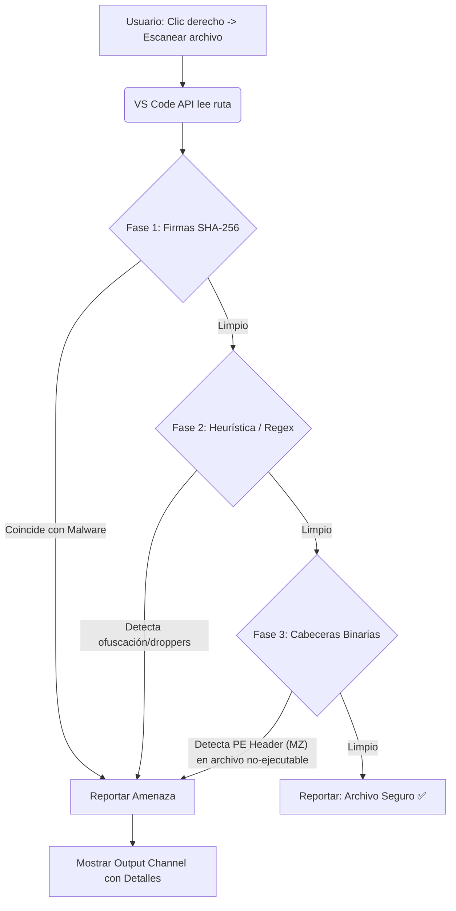

<div align="center">
  <h1>🛡️ RustGuard Antivirus Scanner - VS Code Extension</h1>
  <p>
    <strong>Tu centinela personal contra el malware, directamente integrado en Visual Studio Code.</strong>
  </p>
  
  [](https://marketplace.visualstudio.com/)
  [](https://nodejs.org/)
  [](https://www.typescriptlang.org/)
  [](https://opensource.org/licenses/MIT)

  <p>
    <a href="#-acerca-del-proyecto">Acerca del Proyecto</a> •
    <a href="#-características">Características</a> •
    <a href="#-cómo-funciona">Cómo Funciona</a> •
    <a href="#-instalación">Instalación</a> •
    <a href="#-uso">Uso</a> •
    <a href="#-arquitectura-y-motores">Arquitectura</a>
  </p>
</div>

---

## 📖 Acerca del Proyecto

**RustGuard Antivirus Scanner** es una extensión de seguridad para Visual Studio Code diseñada para analizar archivos de forma rápida y autónoma sin necesidad de salir del editor. 

A diferencia de otras soluciones que requieren binarios externos o conectividad a internet, esta extensión **no depende de instalaciones de terceros** (como ClamAV) ni envía tus archivos a la nube. Su motor de detección opera al 100% en local analizando firmas (hashes SHA-256), patrones de contenido (Regex) y cabeceras binarias (Heurística PE) para alertarte instantáneamente sobre código sospechoso.

---

## ✨ Características

- 🔍 **Escaneo Integrado:** Analiza cualquier archivo directamente desde el menú contextual (clic derecho) del Explorador de Archivos de VS Code.
- 🚀 **Autónomo y Ligero:** No requiere la instalación de antivirus de terceros ni dependencias externas pesadas.
- 🧠 **Motor de Triple Capa:**
  - *Firmas Criptográficas:* Detección exacta de hashes SHA-256 de malware conocido (incluyendo pruebas EICAR).
  - *Heurística de Contenido:* Expresiones regulares que identifican macros maliciosas, VBScripts, y ofuscación de PowerShell (Base64).
  - *Detección de Archivos Disfrazados:* Analiza las cabeceras binarias (PE `MZ`) para descubrir ejecutables ocultos bajo extensiones inocentes (`.txt`, `.jpg`).
- 📊 **Reportes Detallados:** Panel de salida dedicado en VS Code que detalla cada amenaza encontrada, tamaño del archivo y el motivo de la alerta.
- ⚡ **Alta Performance:** Ignora automáticamente archivos gigantes (>10MB) en el análisis de texto y emplea búferes controlados para evitar el consumo excesivo de RAM.

---

## ⚙️ Cómo Funciona

El motor interno (`extension.ts`) analiza los archivos en tres fases secuenciales al momento de ejecutar el comando `rustguard-vscode.scanFile`:



---

## 🚀 Instalación

Al ser un proyecto en código fuente (y/o empaquetado como VSIX), puedes instalarlo de las siguientes maneras:

### Opción 1: Instalación desde VSIX (Recomendado)

1. Ve a la pestaña **Extensions (Extensiones)** en VS Code (`Ctrl+Shift+X` o `Cmd+Shift+X`).
2. Haz clic en el ícono de los tres puntos `...` (Views and More Actions) en la parte superior derecha del panel de extensiones.
3. Selecciona **"Install from VSIX..."**.
4. Busca y selecciona el archivo `rustguard-vscode-1.0.3.vsix` incluido en el directorio del repositorio.
5. ¡Listo! La extensión está activa.

### Opción 2: Compilación y Desarrollo (Modo Developer)

Si deseas modificar el código o compilarlo tú mismo:

1. Clona el repositorio y abre la carpeta del proyecto en VS Code.
2. Abre la terminal integrada e instala las dependencias:
   ```bash
   npm install
   ```
3. Compila el código TypeScript a JavaScript:
   ```bash
   npm run compile
   ```
4. Presiona `F5` para iniciar una nueva ventana de VS Code (Extension Development Host) con la extensión cargada para realizar pruebas.

---

## 🎮 Uso

La integración con la interfaz de VS Code es natural y directa:

1. Abre el **Explorador** de archivos en VS Code.
2. Selecciona cualquier archivo (código fuente, imágenes, ejecutables) sobre el cual tengas sospechas.
3. Haz **clic derecho** sobre el archivo.
4. En el menú contextual, selecciona **"Escanear con RustGuard Antivirus"**.
5. Revisa la notificación en la esquina inferior derecha:
   - Si el archivo es seguro, verás un recuadro verde indicando: `✅ SEGURO: "archivo.txt" no contiene amenazas conocidas.`
   - Si se detecta un peligro, verás un recuadro amarillo/rojo de alerta. Haz clic en **"Ver detalles"** para que se abra un Panel de Salida (`Output Channel`) detallando qué firmas, patrones de inyección o anomalías binarias se encontraron.

---

## 📁 Arquitectura y Motores

El diseño de la extensión prioriza un acoplamiento mínimo y máxima velocidad.

```text
proyecto-si784-2026-i-u3-antivirus_u3_cds/
│
├── src/
│   └── extension.ts          # Core Scanner: Algoritmos de Hashing, Regex y Buffer Parsing.
├── out/                      # Código JavaScript compilado (Generado).
├── package.json              # Configuración de comandos y menús contextuales en VS Code.
├── tsconfig.json             # Reglas estrictas de compilación TypeScript.
└── rustguard-vscode-*.vsix   # Instalador empaquetado de la extensión.
```

### 🔬 Análisis del Core: `extension.ts`
El sistema incluye patrones predefinidos (Arrays y Diccionarios) cargados en memoria para búsquedas rápidas:
- **Diccionario de Hashes (`KNOWN_MALWARE_HASHES`)**: Mapeo criptográfico directo contra amenazas conocidas (como el EICAR test).
- **Patrones Regex (`SUSPICIOUS_PATTERNS`)**: Diseñados para detectar VBScripts maliciosos, invocaciones remotas de droppers (`Invoke-WebRequest | iex`) y Macros ofuscadas.
- **Inspección de Buffers (`checkBinaryHeaders`)**: Abre el archivo de forma parcial, lee los primeros 512 bytes buscando firmas de ejecutables (PE, `0x4D 0x5A`) y cruza este dato contra un `Set` de extensiones. Si encuentra una discrepancia (ej. un ejecutable camuflado como `.txt`), activa una alarma crítica de seguridad.

---

## 🤝 Contribuciones

Este proyecto es abierto y nos encanta recibir mejoras a los algoritmos heurísticos. Si deseas ampliar la base de datos de firmas o añadir nuevas capas de seguridad:

1. Haz un Fork del repositorio.
2. Crea una rama para tu mejora (`git checkout -b feature/MejoraHeuristica`).
3. Agrega tus patrones en `SUSPICIOUS_PATTERNS` o implementa tus cambios y haz commit (`git commit -m 'Añade nueva validación Regex'`).
4. Sube tu rama al repositorio remoto (`git push origin feature/MejoraHeuristica`).
5. Abre un Pull Request describiendo los impactos de rendimiento y las amenazas que aborda tu código.

---

<div align="center">
  <p>Construido con ❤️ y TypeScript para un ecosistema de desarrollo más seguro.</p>
</div>
